<style> 
    h1 { text-shadow: 2px 2px 5px red; } 
    h2 { text-shadow: 2px 2px gold; } 
    h3 { color: hsl(0, 80%, 50%); 
        text-shadow: 2px 2px 3px gold;} </style> 
<h1> </h1>

# 2018.10.05 DAY29

--------------

# 함수

```html
			console.log(summ);
			console.log(typeof summ); // string, number, boolena, object, function
			
			(function(){
				console.log("익명함수입니다");
			})(); //자동실행 - test할 때
```


## 생성자(함수)

* 생성자를 이용하여 일상 생활의 객체를 표현(정의)할 수 있다
* new 생성자 호출을 통해 인스턴스(객체)를 생성할 수 있다
* 묵시적 생성과 달리 원하는 개수만큼 객체를 쉽게 생성할 수 있다.
* this는 생성된 현재 객체를 의미

 

```html
new fun(0,0)
function name(sssm, , ... ){

this.sssm= sssm; // 지역변수 피하기 --- 생성자

this.study = function(){

--- 기능이 들어감}

}
```

 function 이 생성자의 역할을 하고,데이터를 저장하고,  기능적인 역할을 하기도 함

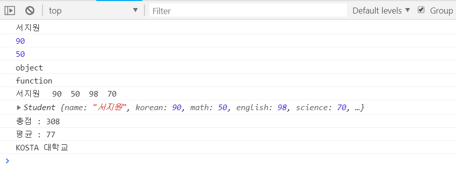

```html
<script type="text/javascript">
	/**
	 * 사용자 정의 객체 (생성자)
	 */

	function Student(name, korean, math, english, science) {
		this.name = name;
		this.korean = korean;
		this.math = math;
		this.english = english;
		this.science = science;

		this.getSum = function() {
			return this.korean + this.math + this.english + this.science;
		}
		this.getAverage = function() {
			return this.getSum() / 4;
		}
		this.toString = function() {
			return this.name + "\t" + this.korean + "\t" + this.math + "\t"
					+ this.english + "\t" + this.science; // 오버라이딩이랑 비슷
		}

	}
	Student.schoolName= "KOSTA 대학교"; // 메모리 저장가능
</script>
</head>
<body>
  <script type="text/javascript">
			var student = new Student('서지원', 90, 50, 98, 70);
			console.log(student.name);
			console.log(student.korean);
			console.log(student["math"]);

			console.log(typeof student); //object
			console.log(typeof Student); //function
			console.log(student.toString()); // toString 찍어보기
			console.log(student); //브라우저가 이거에 대한 값을 문자열로 주는 것 - 브라우저엔진마다 다름
			console.log('총점 : ' + student.getSum());
			console.log('평균 : ' + student.getAverage());
			console.log(Student.schoolName); // 메모리 read
		</script>
</body>
```

* this 키워드를 사용해 프로퍼티와 메소드를 추가할 수 있다

## instanceof 연산자

* 해당 객체가 어떠한 생성자 함수를 통해 생성됐는지 확인할 때 사용

## 프로토타입(prototype)과 객체 상속

* <b>생성자 단점</b> : 프로퍼티는 생성된 모든 객체가 다른 값을 가지지만, 메서드는 객체 마다 가질 필요가 없다 --> 각기 객체를 생성할 때마다 동일한 메소드를 가지는 것은 메모리 낭비

  

* <b>프로토 타입 객체</b> 

  * 데이터 : 함수 안에, 기능: 프로토 타입에 저장
  * <b>자바스크립트는 프로토 타입 기반 객체 지향 언어! </b>

``` html
<script type="text/javascript">
	/**
	 * 사용자 정의 객체 (생성자)
	 */

	function Student(name, korean, math, english, science) {
		this.name = name;
		this.korean = korean;
		this.math = math;
		this.english = english;
		this.science = science;

	}
	Student.schoolName = "KOSTA 대학교";

	// 프로토타입에 메소드 저장
	Student.prototype.getSum = function() {
		return this.korean + this.math + this.english + this.science;
	}
	Student.prototype.getAverage = function() {
		return this.getSum() / 4;
	}
	Student.prototype.toString = function() {
		return this.name + "\t" + this.korean + "\t" + this.math + "\t"
				+ this.english + "\t" + this.science;
	}
</script>
```

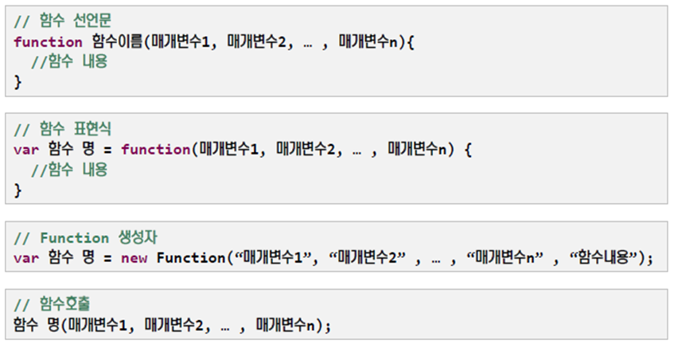

* 함수를 동적으로 쓰고 싶을 때 : Function 생성자

  ```html
  new Function("매개변수1","매개변수2", ... ,"함수내용");
  
  	var sum = new Function("x","y","return x + y;")//동적 함수 생성
  	console.log(sum(2,3));
  ```

  ```html
  			//구조가 어떻게 생겼을까욧
  			console.log(student.constructor);
  			console.log(Student);
  			var student2 = new student.constructor("aaaa",10,20,30,40);
  			console.log(student2);
  ```

  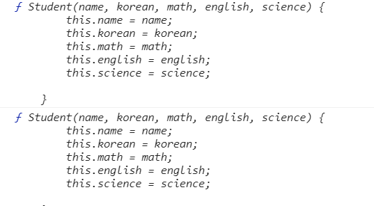

* Objct 는 모든 내장 객체들의 슈퍼객체이다

* 따라서 모든 내장 객체들은 Object 생성자의 프로토타입 객체에 있는 기본적인 프로퍼티들을 상속받는다.

  * 프로토타입 객체 역시 객체이므로 Object() 생성자를 이용하여 만들어진다

  ### prototype 기반 객체 상속 구조

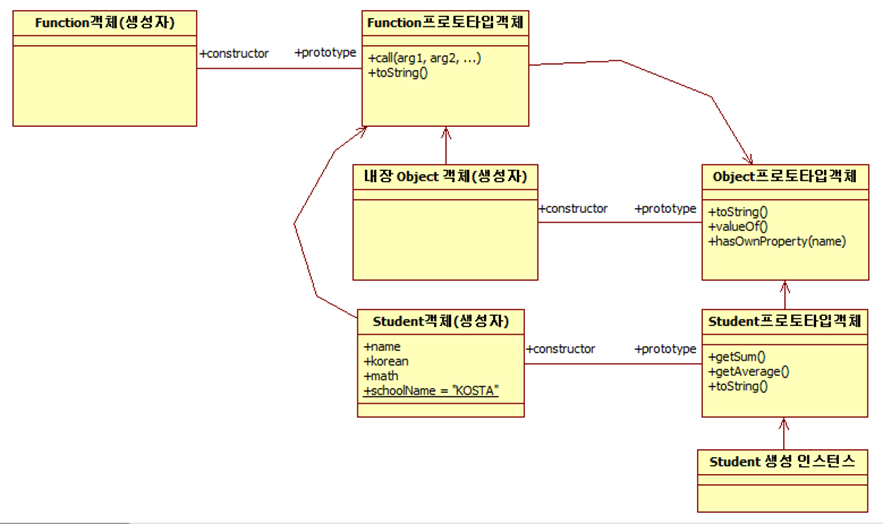

function 객체 - 기능을 위한 객체 & object 객체 

function 객체의 최상의 객체 == function 프로토 타입 객체 

```html
console.log(Student.toString()); //function의 Prototype객체의 toString();
console.log(student.toString()); //Object의 Prototype객체의 toString();
```

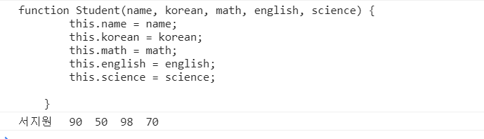

# 생성자 상속

(여태까지는 prototype상속)

* 자바로 따지면 class 상속

* 기본 생성자를 기반으로 새로운 생성자를 정의 <b>(확장)</b>

## 생성자 체이닝

* 서브 생성자 내에서 부모 생성자를 명시적으로 호출하는 것
* call() / apply() - <b>[ : java의 super 역할]</b>함수를 이용하여 생성된 객체의 메소드인 것 처럼 호출

```html
// 부모 객체 정의
	function Shape(x, y) {
		this.x = x;
		this.y = y;
	}
	// Shape 객체의 공통 메소드 정의
	Shape.prototype.getArea = function() {
		return 0;
	}
	Shape.prototype.getRound = function() {
		return 0;
	}
	//1# 자식객체 정의
	function Rectangle(x, y, width, height) {
		//this.x = x;
		//this.x = y;
		// 생성자 체이닝(부모객체의 생성자를 명시적 호출 : super();???)
		// 부모생성자를 생성된 현재객체의 메소드인것 처럼 호출
		Shape.call(this, width, height);
		// 첫번째 전달인자 : 생성자가 소속되어 호출될 객체
		this.width = width;
		this.height = height;
	}
	// #2.Rectangle의 프로토타입 객체로 Shape인스턴스를 설정하여
	// Shape 프로토타입 객체의 공통 메소드를 상속받게 한다. 
	Rectangle.prototype = new Shape(0, 0);
	Rectangle.prototype.getArea = function() {
		return this.width * this.height;
	};
	Rectangle.prototype.getRound = function() {
		return 2(this.width + this.height);
	};
	// #3.Rectangle 인스턴스의 모든 프로퍼티를 상속받게 되므로
	// 필요없는 프로퍼티는 삭제한다.
	delete Rectangle.prototype.x;
	delete Rectangle.prototype.y;
	// #4.마지막으로 Rectangle 프로토타입 객체가 Shape 생성자를
	// 사용해서 만들어졌으므로
	// constructor 프로퍼티는 Shape 생성자를 참조하고 있다.
	// constructor 프로퍼티를 Rectangle로 수정한다.
	Rectangle.prototype.constructor = Rectangle;
```

## 객체 생성

* 명시적 생성 - new와 함께 생성자 호출 : 여러 개의 객체 생성시 주로 사용
* 묵시적 생성 - 객체 리터럴[{}] 이용 : 생성자 정의 없이 하나의 객체 생성 시 주로 사용

```html
<title>묵시적 생성</title>
</head>
<body>
  <script type="text/javascript">
			// 명시적 생성
			//var product = new Object();
			// 묵시적 생성
			/*	var product = {};
				product.name = "7D 건조 망고";
				product.type = "당절임";
				product.element = "망고, 설탕";
				product.origin = "필리핀";*/
			var product = {
				name : "7D 건조 망고",
				type : "당절임",
				element : "망고, 설탕",
				origin : "필리핀",
				price : 700
			};
			console.log(product.name);
			console.log(product["type"]);
			console.log(product['price']);
		</script>
    
/*// 결과
  7D 건조 망고
  당절임
  700
    */  
```

### 메서드 추가 및 호출

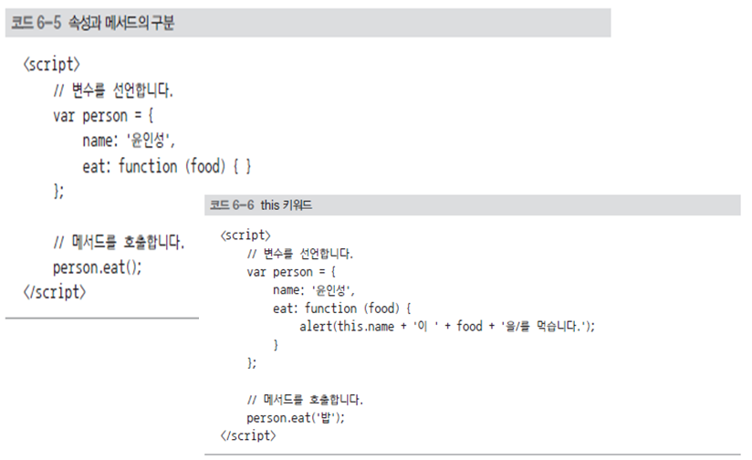

### 생성된 객체에 프로퍼티 동적 추가

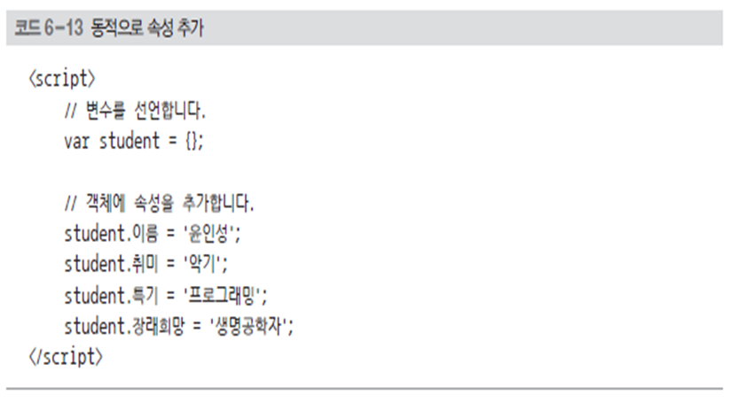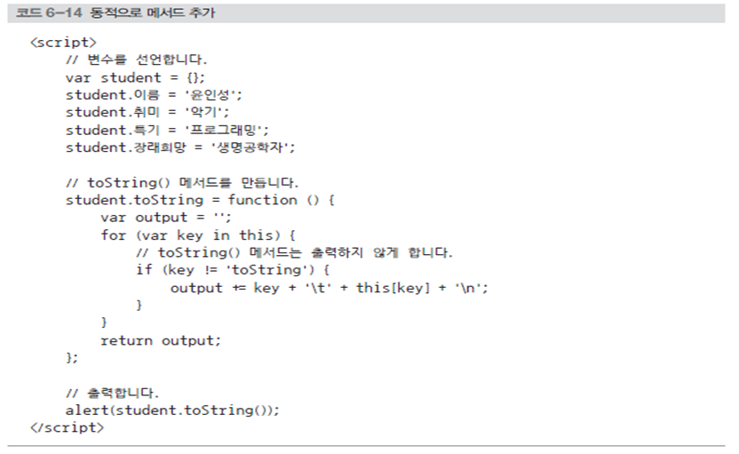

### 생성된 객체의 프로퍼티 동적 제거 - delete 연산자

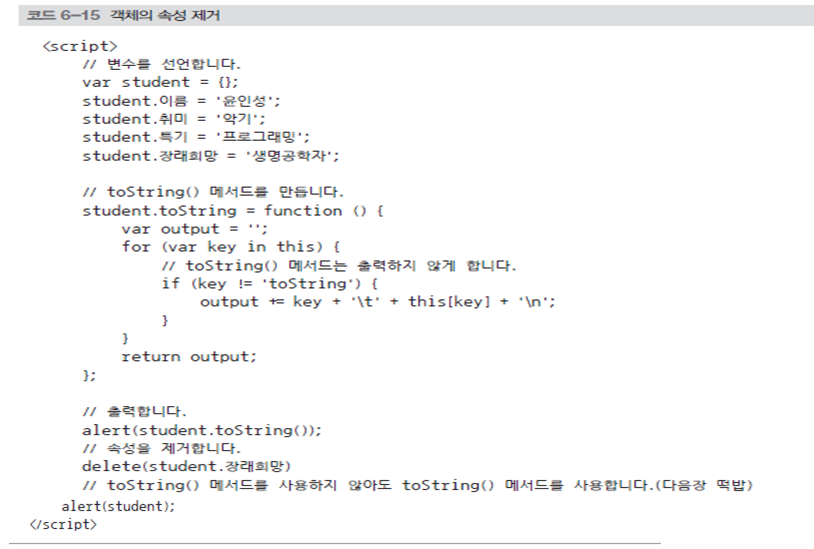

```html
//동적 메소드 추가
			product.toString = function() {
				var output = '';
				for ( var key in this) {
					if (key != 'toString') {
						output += key + "\t" + this[key] + "\n";
					}
				}
				return output;
			};

			console.log(product.name);
			console.log(product["type"]);
			console.log(product['price']);

			console.log(product.toString());

			delete product.price;
			console.log(product.price);

			for ( var name in product) {
				console.log(name + ": " + product[name]);
			}
			
			var string = new String('서지원');
			for ( var name in string) {
				console.log(name + ": " + string[name]);
			}
			for ( var name in String.prototype) {
				//console.log(name);
			}
			console.log('type' in product);
```

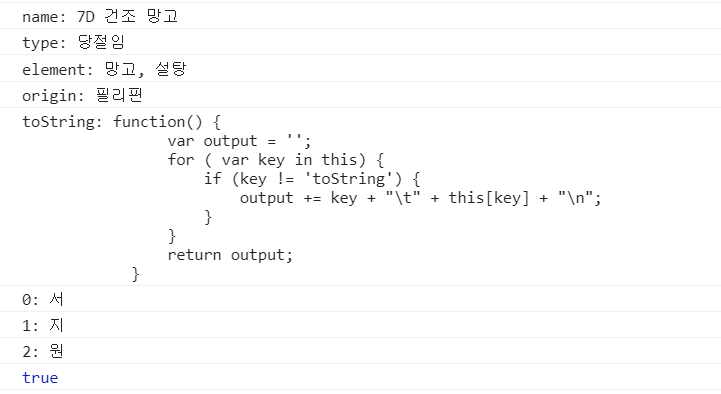

------------------------------

-------------------------------------------------------------------

# 자바 스크립트 내장(표준) 객체

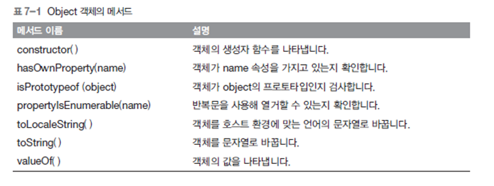

```html
console.log(student.hasOwnProperty("name")); -- T/F
```

* max_value & min_value : 최대, 최솟 값

  ### Math 객체

  	

  * 기본적인 계산 기능과 상수를 제공하는 내장 개체
  * new Math()같이 객체를 생성하여 사용할 수 없음
  * 

  	