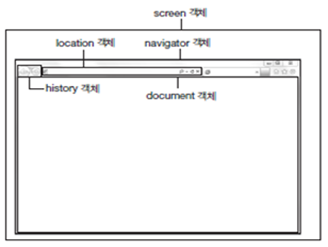
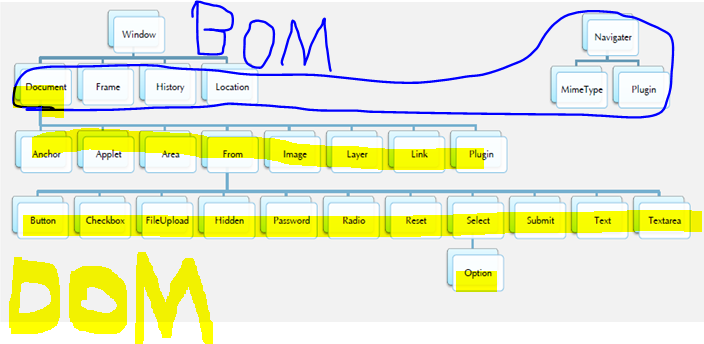
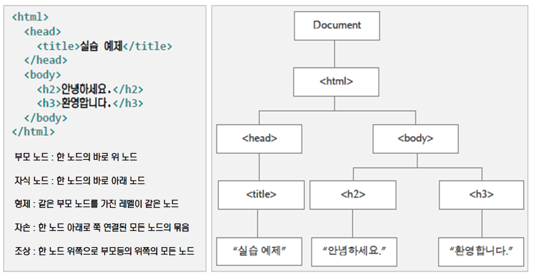
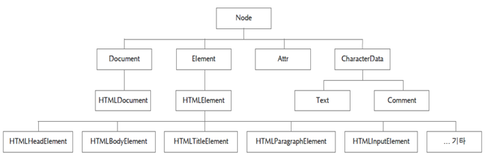
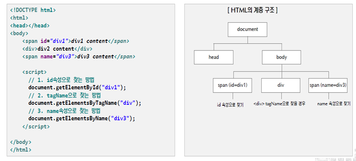
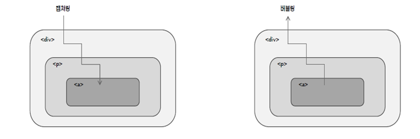

# 2018.10.08 DAY30

-----------------------

BOM : 브라우저 객체

DOM : html 문서 객체

Event handling 

## 정규표현식

split : 패턴으로 나눔! 

replace : 패턴과 같은 문자열을 변환 

math : 패턴과 일치하는 문자열을 리턴함

position: 패턴과 일치하는 문자열을 찾는것 - 찾는 위치를 return (찾는게 없으면 -1)

test : 해당 글자가 일치하는 문자열이 있는지 확인

``` html
<!DOCTYPE html>
<html>
<head>
<meta charset="utf-8">
<title></title>
</head>
<body>
<script>
// 명시적 생성
var regExp = new RegExp("패턴");
console.log(regExp.constructor);// 오브젝트의 타입을 체크 : == 을 써서 체크 
// 묵시적 생성
console.log(typeof /패턴/); // object, 배열 , string ... -- 묵시적생성 --> 값 : object

var str = "The quick brown fox jumps over th lazy dog.";
//var ss = str.split(new RegExp("\\s")); 
var tokens = str.split(/\s/); //결과 : 배열
for ( var i in tokens) {
	console.log(tokens[i]);
}


// Self 호출을 이용한 정규표현식 테스트
(function() {
	var s = "1    , 2, 3, 4, 5";
	// * : 앞의 항목이 0번 이상 
	var ss = s.split(/\s*, \s*/);

	for(i in ss) {
		document.write(ss[i]);
		document.write("<br>");
	}
})();


(function() {
	var str = "JavaScript is more fun than java!";
	// g : 전역매칭 수행(처음 매치에서 끝내지 않고 모든 매치 찾음) 
	// i : 대소문자 구별하지 않음. 
	// m : 여러 라인에 있을 때에도 검색 
	var pattern = /Java/gi; 
	var arr = str.match(pattern); //match - 일치하는 애 찾아옴 

	for(var i=0; i<arr.length; i++) {
		document.write(arr[i]);
		document.write("<br>");
	}
	document.write("<br>");			
})();


(function() {
	var src = "azcafAJAC";
	var reg = /[a-c]/g;
	var result = src.match(reg);

	for(var i=0; i<result.length; i++) {
		document.write(result[i]);
		document.write("<br>");
	}
	document.write("<br>");	
})();


(function() {
	var src = "1 2 3 444 is but a d4ream wi3th in a dream";

	// \d : 모든 숫자 
	// + : 앞의 항목의 한 번 이상 
	var reg = /\d+/g;
	var result = src.match(reg);
	document.write(result);
	document.write("<br>");
})();


(function() {
	var str = "is this all ther is?";
	var patt = /[^h]/g; //부정
	var result = str.match(patt);
	document.write(result);
	document.write("<br>");
})();


(function() {
	var s = "the batter hit the ball with the bat";
	var reg = /the/g;
	var result = s.replace(reg, "a");
	document.write(result);
	document.write("<br>");
})();


(function() {
	var src = "is but a Dream within a dream";
	var reg = /dream/;

	var position = src.search(reg);
	document.write(position);
	document.write("<br>");
})();

</script>
</html>

```

```html
<!DOCTYPE html>
<html>
<body>

<h2>JavaScript Regular Expressions</h2>

<p>Search for an "e" in the next paragraph:</p>

<p id="p01">The best things in life are free!</p>

<p id="demo"></p>

<script>
text = document.getElementById("p01").innerHTML; 
document.getElementById("demo").innerHTML = /best/.test(text);
</script>

</body>
</html>

// 값 : true 
```

# Window 객체 (BOM)



alert 

comfirm

prompt

parseInt 

open (frame 새로 만들기 ) 

close (finish / exit메서드랑 비슷 )

Navigator  : 브라우저 정보를 추상화해서 만든 객체

			

 navigator.userAgent : 크롬 .. 등등 

	


문서안의 구성요소들 : DOM 

Element : html, head, body .. 

Attribute : href, src ... 

Text : text ... 

 -- getElementById

 -- getElementByTag.. 


## 브라우저 객체

### Navigator Object 

 브라우저의 정보가 내장된 객체

### Location

  현재 페이지 주소(URL) 등을 알 수 있음 

	

  다른 페이지로 이동


replace,  assign, href: 이동하는 방법 - method 이용 

reload : 새로고침


## 문서 객체 모델(DOM)

### 문서 객체 모델 (Document Object Model)

* DOM API 사용

* 모든 브라우저들은 DOM규약을 준수하는 DOM Parser를 내장하고 있음

* Document : HTML, XML문서
* HTML Document : HTML의 문서와 요소
* HTMLElement의 하위 타입 : HYML 단일 요서나 요서 집합의 속성에 해당하는 JavaScript 프로퍼티를 정의
* Comment 노드 : HTML이나 XML의 주석

ex) < h2 xx=yy> text< /h2> : h2 - 부모, xx=yy & text - 자식

#### 검색방법



	


## 이벤트 처리 : 버블링과 캡처링

* 이벤트 버블링 : 이벤트 발생 요소부터 요소를 포함하는 부모 요소까지 올라가면서 이벤트를 검사하는 것
* 이벤트 캡쳐링 : 이벤트가 발생한 요소를 포함하는 부모 HTML로부터 이벤트 근원지인 자식요소까지 검사하는 것(거의 쓰지 않는 기능-default : false)