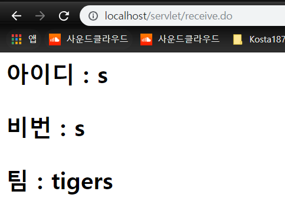

# 2018.10.11 Day 32

------------------

-----------------

* HTTP 응답상태코드

# WAS

웹 컴포넌트(Servlet/JSP)를 배치/ 생성하고 실행할 수 있는 서블릭 엔진(서블릿 컨테이너)을 지원하는 앱 서버 : Web Application Server 

ex : Apache Tomcat

# Servlet Programming

여기에 프로그램 저장

```java
public class HelloServlet extends HttpServlet /*implements Servlet*/{
	@Override
	protected void doGet(HttpServletRequest req, HttpServletResponse resp) throws ServletException, IOException {
		// TODO Auto-generated method stub
		super.doGet(req, resp);
	}
}

// HttpServletRequest req : 보내는 메세지
// HttpServletResponse resp : 받는 메세지 - 스트림 내장되어 있음
```

* HTTP 요청에 대해 응답메세지를 동적으로 생성하여 서비스를 수행하는 작은 웹 프로그램(웹 컴포넌트)
* WAS내의 서블릿 엔진에 의해 배치, 관리되며 대표적인 javaEE 기반 자바 웹 표준기술
* 서블릿 컨테이너는 서블릿의 라이프사이클을(생성, 실행, 삭제)해 주며 웹 클라이언트 요청이 있을 경우 서블릿을 실행시켜 요청에 대한 응답을 처리하는 서버 모듈로, 웹 애플리케이션 서버의 일부분
* 위임 - dispatch 
* 컨테이너 - request + response로 나눔 (2개의 객체 생성)/ 메모리스트림.. 같은 역할 

1. 사용자의 서블릿 요청

2. 컨테이너는 2개의 객체 생성

3. 요청 URI를 분석하여 어떤 서블릿에 대한 요청인지 알아낸다

4. 컨테이너는 서블릿 객체의 service()메소드 호출하면서 request, response객체 전달

   thread 의 run과 비슷 .. 

5. doGet() 메소드는 동적 콘텐츠를 생성한 다음 response 객체에 출력 (메모리스트림 같은 역할)

6. 컨테이너는 response 객체를 HTTP 응답 메시지로 변환하여 웹 클라이언트로 전송하고 request와 response 객체를 소멸시킴

```java
package kr.or.kosta.servlet;

import java.io.IOException;
import java.io.PrintWriter;

import javax.servlet.ServletException;
import javax.servlet.http.HttpServlet;
import javax.servlet.http.HttpServletRequest;
import javax.servlet.http.HttpServletResponse;

/**
 * 마임타입 이해를 위한 서블릿
 */
public class MIMEServlet extends HttpServlet {
	// 메모리에 저장할 때 클래스가 바뀔 때마다 충돌을 막기 위해 구분해주려고 ~ : 냅둬도 되고 추가해도 되고
	// private static final long serialVersionUID = 1L;

	/**
	 * @see HttpServlet#HttpServlet()
	 */
	/*
	@Override
	public void init() throws ServletException {
		// TODO Auto-generated method stub
		super.init();
	} 상속되어있음 */ 
	
	protected void doGet(HttpServletRequest request, HttpServletResponse response)
			throws ServletException, IOException {
		response.setContentType("text/plain; charset=utf-8");
		// Content-Type:text/plain; charset=utf-8
		PrintWriter out = response.getWriter();
		out.println("일반적인 텍스트 입니다... ");
		
	}

}

```

### MINE 타입

* 다목적 인터넷 메일 확장 규약

* 8가지 형식 존재 - 'application‘, 'audio‘, ‘image’, ‘message’, ‘model’, multipart', ‘text’, ‘video’

  

```java
package kr.or.kosta.servlet;

import java.io.FileInputStream;
import java.io.IOException;
import java.io.InputStream;
import java.io.OutputStream;

import javax.servlet.ServletException;
import javax.servlet.http.HttpServlet;
import javax.servlet.http.HttpServletRequest;
import javax.servlet.http.HttpServletResponse;

/**
 * 음악 서비스 서블릿
 */
public class MIMEServlet2 extends HttpServlet {
	private final static String path = "C:\\KOSTA187\\workspace\\ServletStudy\\WebContent\\assets\\";
	// private String file = "music.mp3";
	private String file = "sample.ppt";

	protected void doGet(HttpServletRequest request, HttpServletResponse response)
			throws ServletException, IOException {
//		response.setContentType("audio/mpeg");
		response.setContentType("application/vnd.ms-powerpoint");
		// 바이트입력스트림 생성
		InputStream in = new FileInputStream(path + file);

		// response가 제공하는 바이트입력스트림 취득
		OutputStream out = response.getOutputStream();
		byte[] buffer = new byte[1024];
		int count = 0;
		try {
			while ((count = in.read(buffer)) != -1) {
				out.write(buffer, 0, count);
			}
		} finally {
			if (out != null)
				out.close();
			if (in != null)
				in.close();
		}
	}
}

```

### 서블릿 라이프 사이클


class.forname으로 동적생성

어떤 순서로 진행될까?  -- 싱글턴패턴

```java
package kr.or.kosta.servlet;

import java.io.IOException;
import java.io.PrintWriter;

import javax.servlet.ServletConfig;
import javax.servlet.ServletException;
import javax.servlet.http.HttpServlet;
import javax.servlet.http.HttpServletRequest;
import javax.servlet.http.HttpServletResponse;

/**
 * 서블릿 생명주기 테스트를 위한 서블릿
 */
public class LifecycleServlet extends HttpServlet {
	private static final long serialVersionUID = 1L;

	private int count;

	/**
	 * @see HttpServlet#HttpServlet()
	 */
	public LifecycleServlet() {
		System.out.println("LifecycleServlet() Calledd... ");
	}

	/**
	 * @see Servlet#init(ServletConfig)
	 */
	public void init(ServletConfig config) throws ServletException {
		System.out.println("init() Calledd... ");
		//super.init(config); // override 했을때 init() 불러오려면 이거 써야함
		count = 0;

	}
	//@Override
	public void init() throws ServletException {
		System.out.println("init() Calledd... "); // override 하면 이거 안불러옴

	}
	/**
	 * @see Servlet#destroy()
	 */
	public void destroy() {
		System.out.println("destroy() Calledd... ");
	}

	/**
	 * @see HttpServlet#service(HttpServletRequest request, HttpServletResponse
	 *      response)
	 */
	protected void service(HttpServletRequest request, HttpServletResponse response)
			throws ServletException, IOException {
		count++;
		System.out.println("service( request,  response) Calledd... ");
		super.service(request, response);
	}

	/**
	 * @see HttpServlet#doGet(HttpServletRequest request, HttpServletResponse
	 *      response)
	 */
	protected void doGet(HttpServletRequest request, HttpServletResponse response)
			throws ServletException, IOException {
		System.out.println("doGet( request,  response) Calledd... ");
		
		response.setContentType("text/html; charset=utf-8");
		PrintWriter out = response.getWriter();
		out.println("<html>"); // html 을 보냄
		out.println("<head>");
		out.println("<title>Servlet Programming</title>");
		out.println("<meta charset=\"utf-8\">");
		out.println("</head>");
		out.println("<body>");

		out.println("<h2>당신은 " + count + " 번째 방문자입니다..</h2>");

		out.println("</body>");
		out.println("</html>");
	}

	/**
	 * @see HttpServlet#doPost(HttpServletRequest request, HttpServletResponse
	 *      response)
	 */
	protected void doPost(HttpServletRequest request, HttpServletResponse response)
			throws ServletException, IOException {
		System.out.println("doPost( request,  response) Calledd... ");
		doGet(request, response);
	}

}
```


#### 서블릿 API

* 서블릿 컨테이너에 관리되는 서블릿의 개발과 실행을 가능하게 하는 인터페이스와 클래스들의 집합
* 모든 서블릿은 javax.servlet.Servlet 인터페이스를 구현해야 하며, 일반적으로 Servlet인터페이스를 구현한 javax.servlet.GenericServlet과 GenericServlet을 상속한 javax.servlet.http.HttpServlet 을 사용한다

-나머지는 다 규격 - web Contents가 제공 

-동글 감싼거 - 의존관계 : 요청관계에 있는걸 파싱 - web container


#### 클라이언트 요청 메시지 처리

- getServerName() : String
- getServerPort() : int
- getServletContext() : ServletContext
- getServletPath() : String - 서블릿 주소(이름) 동적으로 얻어오는 것
- getRemoteHost() : String
- getRemoteAddr() : String - 브라우저 아이디 동적으로 얻는 것
- getMethod() : String
- getRequestURL() : StringBuffer - 요청 url이 뭔지
- getRequestURI() : String
- getProtocol() : String - protocol뭔지
- getQueryString() : String - query받아오는것
- getHeader(name: String) : String - header 이름 쓰면 값이 떨어짐
- getHeaderNames() : Enumeration - 동적으로 header이름 알아올 때 씀
- getContentType() : String  - MIME타입 뭔지
- getContentLength() : int - 사이즈

웹 애플리케이션 이름(getContextPath)과 서블렛 이름(getServletPath)을 꼭 알아야함

### 클라이언트 form 데이터 처리

*  클라이언트는 html form태그를 이용하여 사용자 입력 정보를 서블릿에 전달함

* Form태그의 3가지 속성

  * method
    * get : 디폴트요청방식
    * post : 응답메시지의 바디에 data stream형태로 보내진다
    * head(body없이 head만 보내는 것), put, delete, trace(보낸걸 그대로 return), options : html에 지원하지 않음
  * action
    * url 절대경로와 상대경로를 이용하여 form 태그의 정보를 전달받을 서블릿 설정
    * 생략시 현재 웨 페이지 url
  * enctype
    * 데이터의 인코딩 방식을 설정하며 요청방식이 post형식일 경우만 사용가능
    * 생략시 application/x-www-form-urlencoded 
      * ?xxx=xxx& ... : 이렇게 받아옴
    * 파일 업로드처리시 multipart/form-data

* 사용자가 입력한 정보 전달을 위한 서브 태그

  * input, select, textarea

    ``` java
    <form action=“/webAppName/someServlet“ method="post">
         <input type=“text” name=“id”/>
         <select name=“job”/>
         <textarea name=“message”/>
    </form>
    ```

method="post "  

``` html
<!DOCTYPE html>
<html>
<head>
<meta charset="utf-8">
<title>폼관련 예제</title>
</head>
<body>
  <h2>폼 관련 태그들...</h2>
  <form action="/servlet/receive.do" method="post" entype="application/x-www-form-urlencoded">
  <fieldset>
  <legend>로그인정보</legend>
  <label>아이디: <input type="text" name="userid" autocomplete="off"></label>
  <label>비밀번호 : <input type="password" name="userpw"></label><br>
    <!-- <input type="button" value="로그인" name="login"> -->
    <input type="submit" value="로그인" name="login"> <!-- 보내는 기능 같이 있는 버튼 -->
    <input type="reset" value="취소"></fieldset>
    <select name="teams" multiple><!-- ="multiple" & 값도 멀티플 -->
      <option value="tigers">두산 베어스
      <option value="lions">sk 라이온즈
      <option value="giants">한화 자이언츠
    </select>
    
    <textarea name="" rows="5" cols="50">점심먹고 합시다</textarea>
    
    <label>남자<input type="radio" name="gender" value="M" ></label><!-- value선택 안하면 gender=on -->
    <label>여자<input type="radio" name="gender" value="F" checked></label>
    
    <input type="hidden" name="some" value="test"> <!-- 안보이는 애 -->
    <input type="file" name="file_upload">
    <input type="image" src="images/icons4803.png">
    
    <label>등산<input type="checkbox" name="hobby" value="h"></label>
    <label>워킹<input type="checkbox" name="hobby" value="w"></label>
    <label>독서<input type="checkbox" name="hobby" value="r"></label>
    
    
    
    
    <button>버튼</button>
  </form>
</body>
</html>
```


``` java
package kr.or.kosta.servlet;

import java.io.IOException;
import java.io.PrintWriter;
import java.util.Calendar;
import java.util.Enumeration;

import javax.servlet.ServletException;
import javax.servlet.http.HttpServlet;
import javax.servlet.http.HttpServletRequest;
import javax.servlet.http.HttpServletResponse;

/**
 * 에코
 */
public class ReceiveServlet extends HttpServlet {
	private static final long serialVersionUID = 1L;

	protected void doGet(HttpServletRequest request, HttpServletResponse response)
			throws ServletException, IOException {
		process(request, response);
	}
	protected void doPost(HttpServletRequest request, HttpServletResponse response)
			throws ServletException, IOException {
		process(request, response);
	}
	public void process(HttpServletRequest request, HttpServletResponse response) throws IOException {
		response.setContentType("text/html; charset=utf-8");
		PrintWriter out = response.getWriter();

		// 요청 파라메터 수신
		String userId = request.getParameter("userid");
		String userPw = request.getParameter("userpw");
		String team = request.getParameter("teams");
		String[] hobbys = request.getParameterValues("hobby"); // 선택안하면 null
		Enumeration<String> paramNames = request.getParameterNames();

		out.println("<html>");
		out.println("<head>");
		out.println("<title>Servlet Programming</title>");
		out.println("<meta charset=\"utf-8\">");
		out.println("</head>");
		out.println("<body style='font-size: 20pt;'>");
		out.println("<h3>아이디 : " + userId + "<h3/>"); // 전달되는게 없으면 null & 값 입력안된거 오면 빈문자
		out.println("<h3>비번 : " + userPw + "<h3/>");
		out.println("<h3>팀 : " + team + "<h3/>");
		if (hobbys != null) {
			for (String hobby : hobbys) {
				out.println("<h3>취미 : " + hobby + "<h3/>");
			}
		}

		while (paramNames.hasMoreElements()) {
			String name = paramNames.nextElement();
			String value = request.getParameter(name);
			System.out.println(name + "=" + value);

		}
		out.println("</body>");
		out.println("</html>");
	}

}

```

해결

```html
<!DOCTYPE html>
<html>
<head>
<meta charset="utf-8">
<style>
input[type=text], select {
	width: 100%;
	padding: 12px 20px;
	margin: 8px 0;
	display: inline-block;
	border: 1px solid #ccc;
	border-radius: 4px;
	box-sizing: border-box;
}

input[type=submit], input[type=button] {
	width: 100%;
	background-color: #4CAF50;
	color: white;
	padding: 14px 20px;
	margin: 8px 0;
	border: none;
	border-radius: 4px;
	cursor: pointer;
}

input[type=submit]:hover {
	background-color: #45a049;
}

div {
	border-radius: 5px;
	background-color: #f2f2f2;
	padding: 20px;
	width: 40%;
	margin: 10px auto;
}

h3 {
	text-align: center;
}
</style>
    // 명시적 submit
<script type="text/javascript">
	window.onload = function() {
		eventRegist();
	}
	function eventRegist() {
		document.getElementById("loginButton").onclick = function() {
			sendSever();
		};

	}
	function sendSever() {
		var firstName = document.getElementById("fname").value;
		if (!firstName || firstName.trim().length == 0) {
			alert("이름을 입력하세요.. ");
		} else {
			document.loginForm.action="/servlet/receive.do";
			document.loginForm.method="get";
			document.loginForm.submit();
		}
	}
</script>
</head>
<body>
  <h3>한글</h3>
  <div>
    <form name="loginForm">
      <label for="fname">First Name</label> <input type="text"
        id="fname" name="firstname" placeholder="Your name.."> <label
        for="lname">Last Name</label> <input type="text" id="lname"
        name="lastname" placeholder="Your last name.."> <label
        for="country">Country</label> <select id="country"
        name="country">
        <option value="australia">Australia</option>
        <option value="canada">Canada</option>
        <option value="usa">USA</option>
      </select>
      <!-- 버튼 누른다고 무조건 보내지마! 
      <input type="submit" value="로그인"> 
      <input type="image"  src="">
      <button>로그인</button> 
      -->
      <input type="button" value="로그인" id="loginButton">
    </form>
  </div>
</body>
</html>

```

#### 서블릿 응답 메시지 처리

