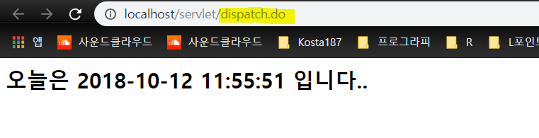
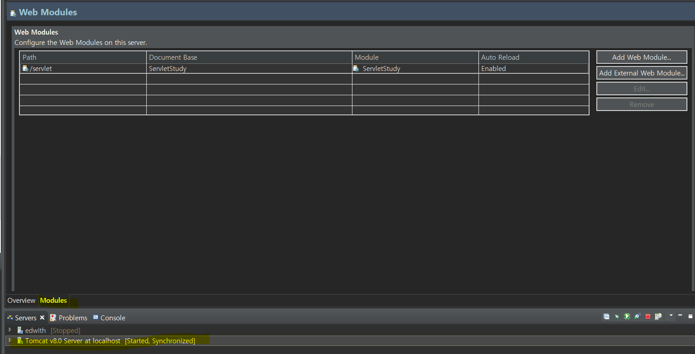

# 2018.10.12 DAY33

------------------

get 방식 - utf-8로 인코딩됨

post방식 - encoding method 사용해야함

* sendRedirect : 브라우저가 다시 요청할 수 있게 해줌(2가지기능합침)

  ```java
  response.setStatus(HttpServletResponse.SC_MOVED_PERMANENTLY);
       response.setHeader(“Location”, “/someURL”);
  
       // response.sendRedirect(“/someURL”);
       // HTML META 태그와 동일 기능
       // <meta http-equiv="refresh" content="0; URL=/someURL">
  ```

## 서블릿 초기 설정 정보 읽기

```java
public void init(ServletConfig config) throws ServletException {
     // 서블릿 초기화 시 한번만
     config.getInitParameter(“paramName”);
}

public void doGet(HttpServletRequest request, HttpServletResponse response) throws ServletException, IOException {
     // 클라이언트 요청 시 마다
     // ServletConfig config = getServletConfig();
     // config.getInitParameter(“paramName”);
     
     // getInitParameter(“paramName”);
}
```

## 클라이언트 요청 디스패치(위임)

``` 
forward(request: HttpServletRequest, response: HttpServletResponse): void - 기능 위임
include(request: HttpServletRequest, response: HttpServletResponse): void - 기능 가져와서 재사용 
```

```java
public void doGet(HttpServletRequest request, HttpServletResponse response) throws ServletException, IOException {
     // 디스패치 대상에게 데이터 전달을 위해
     // request.setAttribute(attName: String, attValue: Object);
     // request.getAttribute(attName: String) : Object
     // request.removeAttribute(attName: String): void

     // getServletContext().getRequestDispatcher("/someServlet").forward(request, response);
     request.getRequestDispatcher("/someServlet").forward(request, response);

     // getServletContext().getRequestDispatcher("/someServlet").include(request, response);
     request.getRequestDispatcher("/someServlet").include(request, response);
}
```

* dispatch 실습

```java
package kr.or.kosta.servlet;

import java.io.IOException;

import javax.servlet.RequestDispatcher;
import javax.servlet.ServletException;
import javax.servlet.http.HttpServlet;
import javax.servlet.http.HttpServletRequest;
import javax.servlet.http.HttpServletResponse;

/**
 * Servlet implementation class HelloServlet2
 */
public class DispatchServlet extends HttpServlet {

	protected void doGet(HttpServletRequest request, HttpServletResponse response)
			throws ServletException, IOException {
		
		//디스패치 기술
		//response.sendRedirect(location);
		RequestDispatcher rd = request.getRequestDispatcher("/hello.do"); //path에 자기 컨테이너 안에 있는 애들만 가능! 외부 안됨
		// 서블릿 이름으로 인식해서 /servlet/servlet/hello.do 이렇게 인식함 === 자기 컨테이너 안으로 어차피 인식
		
		rd.forward(request, response);
	}
}
```

-> model2기법



<b>dispatch --> 주소 안바뀜</b>

## ServletContext

- 서블릿 컨테이너 환경 정보를 제공하며, 컨테이너에 의해 관리되는 서블릿들의 <b>데이터 공유</b>를 위해 제공됨 ex) 회사 조직도

- ServletContext의 주요 메소드

  * getServletName(): String

  * getMajorVersion(): int - 아파치 톰캣 버전 확인

  * getContextPath() : String - request에서도 제공 

  * getServletContextName() : String

  * getServletNames(): Enumeration

  * getServlet(name: String): String

  * getInitParameter(paramName: String): String 

  * getInitParameterName(): Enumeration

  * getRequestDispatcher(url: String): RequestDispatcher

  * <b>getAttribute(attName: String): String</b>

  * <b>setAttribute(attName: String, attValue: String): void</b>

  * <b>removeAttribute(attName: String): void</b>

- 같은 기능을 하더라도 scope가 중요 - ServletContext가 제일 넓음

```java
public void doGet(HttpServletRequest request, HttpServletResponse response) throws ServletException, IOException {
     ServletContext context = getServletContext();
}
```

``` java
package kr.or.kosta.servlet;

import java.io.IOException;

import javax.servlet.ServletContext;
import javax.servlet.ServletException;
import javax.servlet.http.HttpServlet;
import javax.servlet.http.HttpServletRequest;
import javax.servlet.http.HttpServletResponse;

public class ServletContextServlet extends HttpServlet {

	protected void doGet(HttpServletRequest request, HttpServletResponse response)
			throws ServletException, IOException {
		
		//message db에서 가져왔다고 가정
		String message="서블릿간의데이터공유입니다";
		
		ServletContext context = getServletContext();
		System.out.println(context.getServerInfo());
		System.out.println(context.getContextPath());
		
		context.setAttribute("message", message);
//		response.sendRedirect("hello.do"); //: 바로 hello.do로 이동
//		response.sendRedirect("/servlet/hello.do"); 도 가능
//		response.sendRedirect("/"+getServletContext()+"/hello.do"); 도 가능 : 동적으로 얻어옴
		String location = context.getInitParameter("Location");
		System.out.println(location);
	}

}
-----------------------------------------------------------------
   //다른 곳에서 
    getServletContext().getAttribute("message") 
 ------------------------------------------------------------------
 //web.xml <!-- 서블릿 컨테이너에 등록된 모든 서블릿을 위한 초기 파라메터 -->
	<context-param>
	<param-name>Location</param-name>
	<param-value>c:/a/b/c/some.xml</param-value>
	</context-param>
	
```


주소 : 바꾸고 싶을 때

## 클라이언트 상태 정보 유지

* 서블릿은 http 프로토콜을 사용하기 때문에 클라이언트와 서버와의 연결관계가 지속적이지 않다

* 같은 사용자가 요청을 여러번 하더라도 request가 같은 사용자가 보낸 것인지 알 수 없기 때문에 클라이언트 상태 정보를 유지해야 하는 웹 애플리케이션 개발 시 많은 어려움이 있음

* 해결 : 세션(HttpSession), 쿠키(Cookie)

* HttpSession : 웹 컨테이너에 개별 클라이언트 상태 정보 저장을 위해 제공

  * getAttribue(attName: String) : Object

  * removeAttribute(attName: String) : void

  * isNew(): boolean,   invalidate(): void 등

  * setAttribute(attName: String, attValue: Object): void

``` java
public void doGet(HttpServletRequest request, HttpServletResponse response) throws ServletException, IOException {
     // 클라이언트에 해당하는 HttpSession 객체 존재 시 HttpSession 객체 반환하고,
     // 존재하지 않을 경우 새로운 HttpSession 생성하여 반환
     // HttpSession session = request.getSession(true);
     HttpSession session = request.getSession();
     
     // 클라이언트에 해당하는 HttpSession 객체 존재 시 HttpSession 객체 반환하고,
     // 존재하지 않을 경우 null 반환
     // HttpSession session = request.getSession(false);
}
```

``` java
package kr.or.kosta.servlet;

import java.io.IOException;

import javax.servlet.ServletException;
import javax.servlet.http.HttpServlet;
import javax.servlet.http.HttpServletRequest;
import javax.servlet.http.HttpServletResponse;
import javax.servlet.http.HttpSession;

/**
 * Servlet implementation class HelloServlet2
 */
public class HttpSessionServlet extends HttpServlet {
	
	
	protected void doGet(HttpServletRequest request, HttpServletResponse response)
			throws ServletException, IOException {
		
		String name = "김기정";
		HttpSession session = request.getSession();
		System.out.println(session.isNew());
		session.setAttribute("userName", name);
		
		//response.sendRedirect("hello2");
	}
}
```

### 쿠키

* 클라이언트의 상태 정보를 클라이언트의 메모리에 '일정한 형식의 텍스트 데이터'로 저장하고, http 요청 시 요청 메시지 헤더에 쿠키를 포함시켜 전송한다

* 쿠키에는 쿠키 이름과 값, 효력을 가지는 도메인과 패스, 유효시간이 저장된다

* 클라이언트마다 300개의 쿠키를 만들 수 있으며, 쿠키 별로 4kb까지 저장할 수 있다.

* 응답메시지 헤더를 통해 웹 클라이언트로 보내는 쿠키 구조

  - Set-Cookie : name=value; expires=date; path=path; domain=domain

    | Set-Cookie         |                            설  명                            |
    | ------------------ | :----------------------------------------------------------: |
    | name=value         |                       쿠키   이름과 값                       |
    | expires=date       | 쿠키가   삭제되는 날짜, 생략   시 현재 브라우저의 세션 동안에만 유효 |
    | path=path          | 쿠키가   유효하게 사용될 수 있는 URL   패스,   생략 시 쿠키를 설정한 문서의 패스 |
    | domain=domain_name | 쿠키가   유효하게 사용될 수 있는 URL   도메인,   생략 시 쿠키를 설정한 도메인 |

* 요청 메시지 헤더를 통해 웹 서버로 보내는 쿠키 구조
  * cookie: name1=value1; name2=value2
  * 

* 활용적인 면에서 쿠키 사용多

  ```java
  document.cookie = "username=John Doe"; : 쿠키를 저장하는 위치
  ```