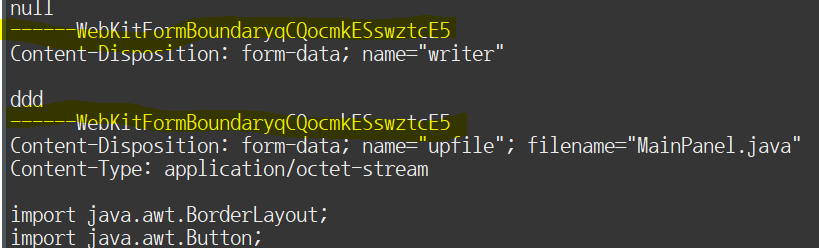
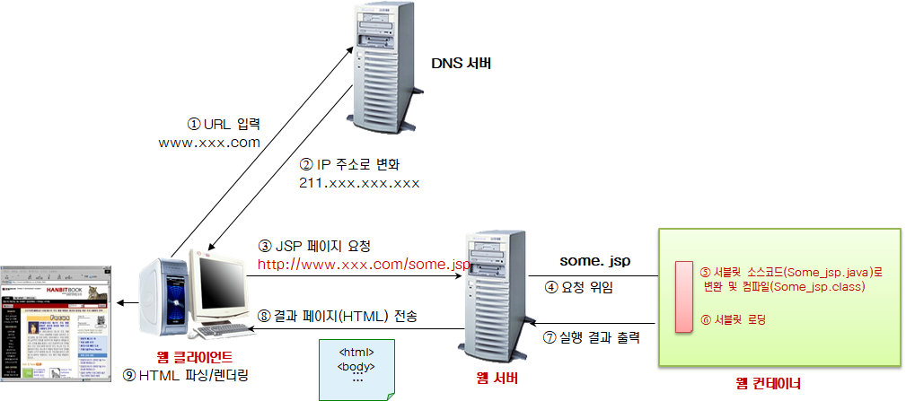
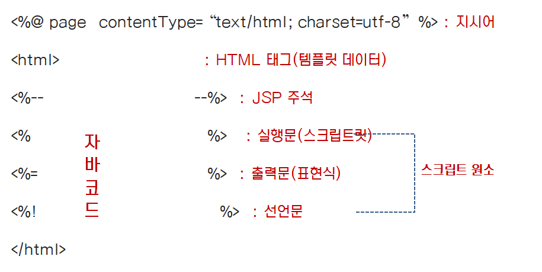
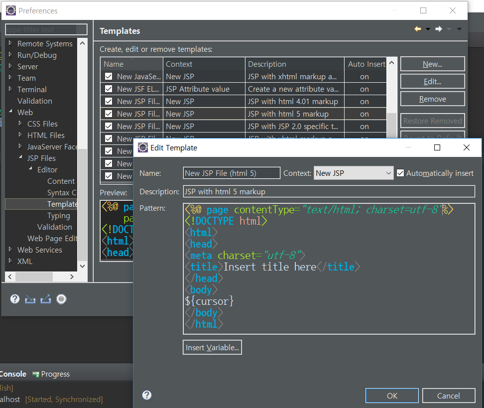
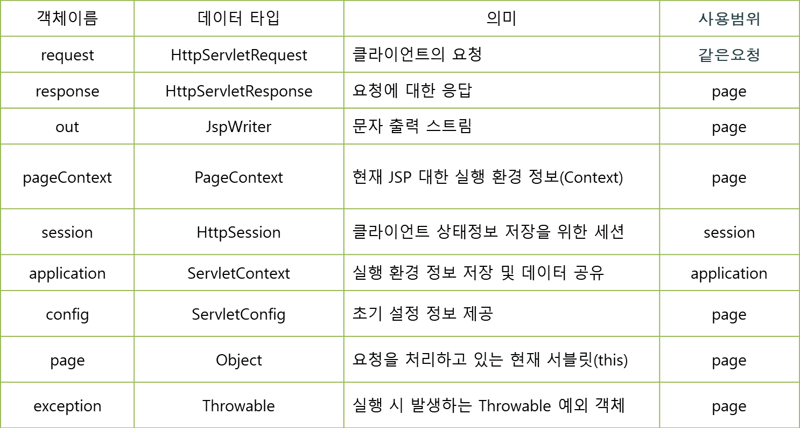

# 2018.10.15 Day34

----------------

-- 로그인 예제

```java
package kr.or.kosta.servlet;

import java.io.IOException;
import java.io.PrintWriter;

import javax.servlet.ServletException;
import javax.servlet.http.Cookie;
import javax.servlet.http.HttpServlet;
import javax.servlet.http.HttpServletRequest;
import javax.servlet.http.HttpServletResponse;

public class MainServlet extends HttpServlet {
	private static final long serialVersionUID = 1L;

	public MainServlet() {
		super();
	}

	protected void doGet(HttpServletRequest request, HttpServletResponse response)
			throws ServletException, IOException {
		process(request, response);
	}

	protected void doPost(HttpServletRequest request, HttpServletResponse response)
			throws ServletException, IOException {
		process(request, response);
	}

	protected void process(HttpServletRequest request, HttpServletResponse response)
			throws ServletException, IOException {
		String loginId = null;
		Cookie[] cookies = request.getCookies();
		if (cookies != null) {
			for (Cookie cookie : cookies) {
				System.out.println(cookie.getName() + " : " + cookie.getValue());
				if (cookie.getName().equalsIgnoreCase("loginId")) {
					loginId = cookie.getValue();

				}
			}
		}

		response.setContentType("text/html; charset=utf-8");
		PrintWriter out = response.getWriter();
		out.println("<!DOCTYPE html>");
		out.println("<html>");
		out.println("<head>");
		out.println("<meta charset=\"utf-8\">");
		out.println("<link rel=\"stylesheet\" type=\"text/css\" href=\"css/basic.css\">");
		out.println("</head>");
		out.println("<body>");
		out.println("<div class=\"header\">");
		out.println("<h1>My Website</h1>");
		out.println("<p>Resize the browser window to see the effect.</p>");
		out.println("</div>");
		out.println("<div class=\"topnav\">");
		out.println(
				"<a href=\"#\">Link</a> <a href=\"#\">Link</a> <a href=\"#\">Link</a> <a  href=\"#\" style=\"float: right\">Link</a>");
		out.println("</div>");
		out.println("<div class=\"row\">");
		out.println("<div class=\"leftcolumn\">");
		out.println("<div class=\"card\">");
		out.println("<h2>TITLE HEADING</h2>");
		out.println("<h5>Title description, Dec 7, 2017</h5>");
		out.println("<div class=\"fakeimg\" style=\"height: 200px;\">Image</div>");
		out.println("<p>Some text..</p>");
		out.println(
				"<p>Sunt in culpa qui officia deserunt mollit anim id est laborum consectetur adipiscing elit, sed do eiusmod tempor incididunt ut labore et dolore magna aliqua. Ut enim ad minim veniam, quis nostrud exercitation ullamco.</p>");
		out.println("</div>");
		out.println("<div class=\"card\">");
		out.println("<h2>TITLE HEADING</h2>");
		out.println("<h5>Title description, Sep 2, 2017</h5>");
		out.println("<div class=\"fakeimg\" style=\"height: 200px;\">Image</div>");
		out.println("<p>Some text..</p>");
		out.println(
				"<p>Sunt in culpa qui officia deserunt mollit anim id est laborum consectetur adipiscing elit, sed do eiusmod tempor incididunt ut labore et dolore magna aliqua. Ut enim ad minim veniam, quis nostrud exercitation ullamco.</p>");
		out.println("</div>");
		out.println("</div>");
		out.println("<div class=\"rightcolumn\">");
		out.println("<div class=\"card\">");
		out.println("<div>");
		if (loginId == null) {
			out.println("<form action=\"login.do\" method=\"post\">");
			out.println(
					"<input type=\"text\" id=\"userid\" name=\"userid\" placeholder=\"Identifier...\"> <input type=\"password\" id=\"userpw\" name=\"userpw\" placeholder=\"Password...\"> <input type=\"submit\" value=\"Login\">");
			out.println("</form>");
		} else {
			out.print("<p>" + loginId + "님 로그인 중 .. </p>");
			out.print("<button onclick=\"location.href='login.do';\">Logout</button>");
		}
		out.println("</div>");
		out.println("</div>");
		out.println("<div class=\"card\">");
		out.println("<h3>Popular Post</h3>");
		out.println("<div class=\"fakeimg\">");
		out.println("<p>Image</p>");
		out.println("</div>");
		out.println("<div class=\"fakeimg\">");
		out.println("<p>Image</p>");
		out.println("</div>");
		out.println("<div class=\"fakeimg\">");
		out.println("<p>Image</p>");
		out.println("</div>");
		out.println("</div>");
		out.println("<div class=\"card\">");
		out.println("<h3>Follow Me</h3>");
		out.println("<p>Some text..</p>");
		out.println("</div>");
		out.println("</div>");
		out.println("</div>");
		out.println("<div class=\"footer\">");
		out.println("<h2>Footer</h2>");
		out.println("</div>");
		out.println("</body>");
		out.println("</html>");
	}
}
```

``` java
package kr.or.kosta.servlet;

import java.io.IOException;

import javax.servlet.ServletException;
import javax.servlet.http.Cookie;
import javax.servlet.http.HttpServlet;
import javax.servlet.http.HttpServletRequest;
import javax.servlet.http.HttpServletResponse;

public class LoginServlet extends HttpServlet {
	private static final long serialVersionUID = 1L;

	// 로그인 처리
	protected void doPost(HttpServletRequest request, HttpServletResponse response)
			throws ServletException, IOException {
		String id = request.getParameter("userid");
		String pw = request.getParameter("userpw");

		// USER DAO를 이용한 회원 가입 여부 체크
		// 무조건 회원이란 가정
		Cookie cookie = new Cookie("loginId", id);
//		cookie.setMaxAge(60*60*24*30);
		cookie.setPath("/");
		response.addCookie(cookie);
		response.sendRedirect("index.html");

	}

	protected void doGet(HttpServletRequest request, HttpServletResponse response) throws IOException {
		Cookie[] cookies = request.getCookies();
		if (cookies != null) {
			for (Cookie cookie : cookies) {
				System.out.println(cookie.getName() + " : " + cookie.getValue());
				if (cookie.getName().equalsIgnoreCase("loginId")) {
					cookie.setPath("/");
					cookie.setMaxAge(0);
					response.addCookie(cookie);
				}
			}
		}
		response.sendRedirect("index.html");
	}
}
```

**서블릿이 데이터를 공유하는 세가지 방법** : servlet context, session, request

 servlet context : 서블릿 컨테이너 안에 들어있는 모든 서블릿들이 사용

## 파일 업로드 처리

* 파일 업로드 HTML Form 태그 작성

* Method - get/ post

* Action - url 절대경로와 상대경로를 이용하여 form 태그의 정보를 전달받을 서블릿 설정

* Enctype - 데이터의 인코딩 방식을 설정하여 요청방식이 post방식일 경우만 사용 가능

                 - application/x-www-form-urlencoded : 생략 시 디폴트

                 - multipart/form-data : 파일 업로드 시 사용

  ``` 
  <form action=“업로드 처리 서블릿” method=“post” enctype=“multipart/form-data”>
       <input type=“file” name=“” />
  </form>
  ```


구분자

---------------------

# JSP

## JSP

* WAS의 웹컨테이너에 의해 생성되고, 싱행, 관리되는 JAVA기반 Server Side Script언어

---- 자바 코드 : servlet -----: 

개발 방식의 처리가 다를 뿐 jsp도 servlet과 같음

스크립트 릿에 담겨있는 애들은 모두 지역변수 

? 인스턴스 변수로 만들고 싶다면 ? = 선언문



