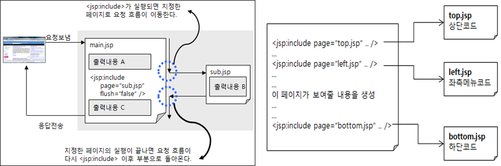
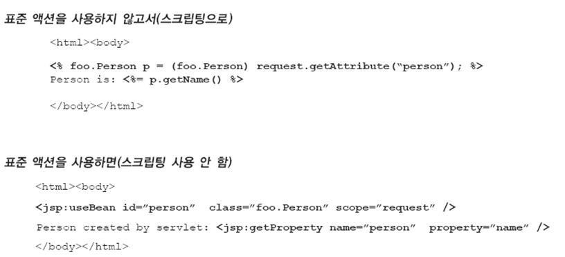
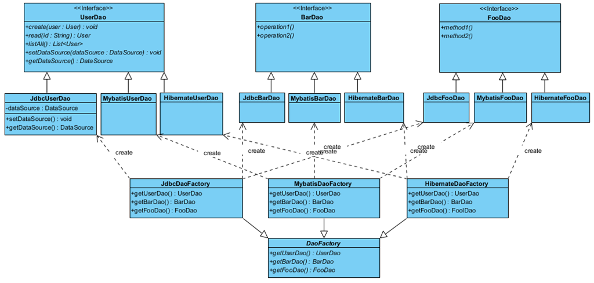

# JSP 

------------------

## JSP 디폴트 객체

* 서블릿 컨테이너에 의해 미리 생성되는 객체

pageContext : 자기 자신만 쓰려는 정보 

jsp 에서만 사용하는 4가지 객체 - pageContext, request, session, application

```xml
	<!-- jsp 등록 -->
	<servlet>
		<servlet-name>defaultObject</servlet-name>
		<jsp-file>/defaultObject.jsp</jsp-file>
		<init-param>
			<param-name>location</param-name>
			<param-value>c:/a/b/xxx.xml</param-value>
		</init-param>
	</servlet>
	<servlet-mapping>
		<servlet-name>defaultObject</servlet-name>
		<url-pattern>/default.action</url-pattern>
	</servlet-mapping>
```

```jsp
<%@ page contentType="text/html; charset=utf-8"%>
<!DOCTYPE html>
<html>
<head>
<meta charset="utf-8">
<title></title>
</head>
<body>
<h2>jsp가 제공하는 9개의 디폴트 객체들 .. </h2>
<%
String id = request.getParameter("id");
//response.sendRedirect("hello.jsp");
out.println("출력이요");

%>

아이디 : <%= id %><br>
WAS에 등록된 웹애플리케이션 이름 : <%= application.getContextPath() %> <!-- /jsp --><br>
요청 URI : <%= application.getServerInfo() %> <!--  Apache Tomcat/8.0.53  --><br>
location : <%= config.getInitParameter("location") %><br><!-- c:/a/b/xxx.xml -->
현재 페이지 : <%=this  %><br><!-- org.apache.jsp.defaultObject_jsp@e109366 -->
현재 페이지 : <%=page  %><br><!-- org.apache.jsp.defaultObject_jsp@e109366 -->
<%-- 예외 : <%=exception %> --%>
</body>
</html>
```

예외처리 몰아서함 --> errorPage  (클라이언트)

isErrorPage --> 서버

``` xml
	<!-- 에러 페이지 등록 -->
	<error-page>
	<exception-type>java.lang.Exception</exception-type>
	<location>/errorHandlingPage.jsp</location>
	</error-page>
```

## 표준 액션 태그(Action Tag)

* 클라이언트의 요청과 응답에 대한 제어권을 JSP페이지 사이에 이동시킬 수 있다(디스패치)
* 자바빈(JavaBean)을 사용할 수 있다
* xml문서를 제어할 수 있다
* 규칙
  * xml 형식을 따르며, 대소문자를 구분
  * 태그명 앞에 jsp라는 접두어를 붙여 사용
  * 시작태그가 있으면 반드시 끝나는 태그가 있어야 한다
  * 내용이 없는 단일태그 사용 시 태그의 마지막 부분을 "/>"로 마무리
  * 태그의 속성값을 할당할 때는 인용부호("")를 사용

< jsp:inclued />

* 웹 컨테이너에 의해 관리되는 다른 리소스(HTML, JSP 등)의 실행 결과를 현재 페이지에 포함시킨다.

* 페이지 모듈화에 사용한다.

<jsp:forward />

* 클라이언트의 요청을 다른 리소스에 위임(dispatch)한다.

* 페이지 흐름을 제어할 때 사용한다.

<jsp:param />

* <jsp:include />, <   jsp:forward>의 서브태그로 파라메터를 전달 할 때 사용한다.

<jsp:useBean />

* 자바빈(JavaBean)을 생성하거나 생성된 자바빈을 검색할 때 사용한다.

<jsp:setProperty />

* 자바빈 프로퍼티(공개된 속성)를 설정할 때 사용한다.

<jsp:getProperty />

* 자바빈 프로퍼티를 얻어올 때 사용한다.¡<jsp:include />

## < jsp:include /> 액션 태그를 이용한 페이지 모듈화



## < jsp:useBean /> 액션 태그

* 자바빈 : 웹 애플리케이션 작성 시 데이터 저장을 목적으로 사용되는 재사용 가능한 컴포넌트

* 자바빈 규약에 따라 디폴트 생성자와 공개된 속성을 제공해야 한다

  ```java
  public class BeanClassName {
      /** 속성(프로퍼티) 선언 */
      private String value;
      
      /** 디폴트 생성자 */
      public BeanClassName() {  }
      
      /** public getter 메소드 */
      public String getValue() {
          return value;
      }
  
      /** public setter 메소드 */
      public void setValue(String value) {
          this.value = value;
      }
  }
  ```

  ``` 
   <jsp:useBean id=“빈 이름 : jsp에서 객체를 접근할 때 사용할 이름” class=“빈 클래스이름 : 패키지 이름을 포함한 빈 클래스의 완전한 이름”  [scope=“빈이 저장될 스코프객체 : page, request, session, application 중 하나를 값으로 설정. 디폴트 값은 page”]/>
  ```

  

* <jsp:setProperty  name=“빈 이름"  property="*" />

  요청 파라미터 이름과 빈 프로퍼티 이름이 동일한 모든 프로퍼티 설정

  폼에 입력한 값을 빈에 설정할 때 유용하게 사용

### Dao 생성을 독립적인 클래스로 캡슐화 - 추상 팩토리 패턴 적용

    

* 많은 수의 관련된 서브 클래스들을 특정 그룹으로 묶어 한번에 교체할 수 있도록 만든 디자인 패턴
* 특정 모듈(라이브러리)를 배포하는데 운영체제 별로 지원하는 기능이 상이하다면, 추상 팩토리 패턴을 적용하여 운영체제 별 기능 변경을 통합적으로 변경할 수 있다.