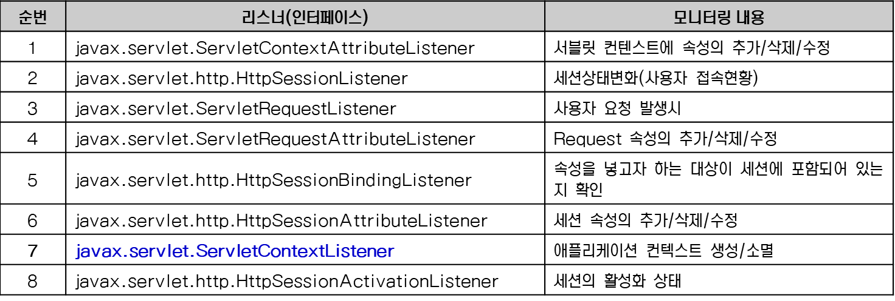
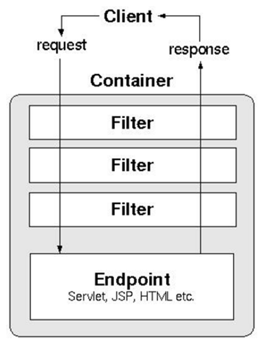
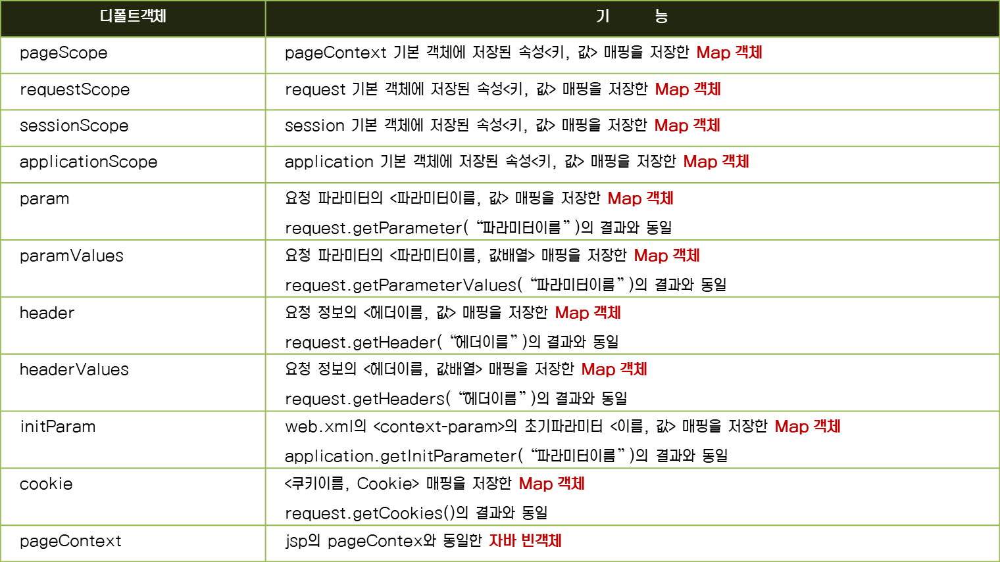
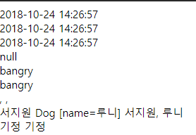
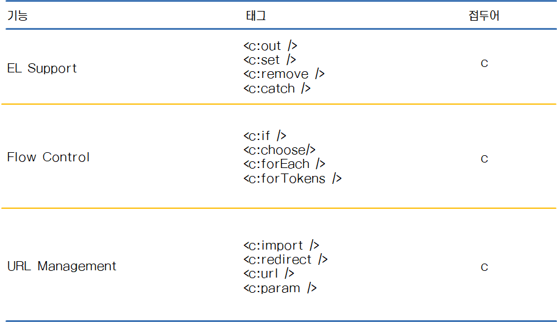

# 2018.10.24  Day 40


## JSP

#####  웹애플리케이션 3대 요소 : 서블릿 , 필터, 리스너


* 동적인 부분과 정적인 부분 나눠서 저장

  -------------------

## Listener 와 Servlet Filter



세션에 대한 모든 이벤트 를 하기 위한 listener - 5번 : action listener 랑 비슷한 역할

### filter

* 특별한 형태의 웹 컴포넌트
* 웹 클라이언트의 요청을 서블릿이나 jsp가 받기 전에 가로채어 특정작업을 수행하기 위해 설계된 웹 컴포넌트
* filter chain - 여러개 등록해두고 순서대로 진행할 수 있음
* filetr 라이프 사이클 - 서블릿과 비슷한 라이프 사이클 : 생성, 초기화, 필터링, 종료

# 표현언어 : expression language

* jsp 단점 - 유지보수가 용이하지 않음

  ``` 
   EL   : ${ applicationScope.mail }
  
   JSP : <%=application.getAttribute(“mail”) %>
  ```

  jsp에 자바스크립트를 쓸 수 있게 해준 것

* EL : 스크립트 언어로 자바코드를 대신해서 값을 쉽고 간결하게 표현가능

* jsp 4개의 스코프 객체 (pageContext, request,session,application)에 저장된 자바만의 속성이나 collection(배열, set, list,map)객체를 쉽게 접근할 수 있다

* 연산자(산술, 관계, 논리)사용 가능

* el 만의 디폴트 객체(11개)제공

* 자바 객체의 인스턴스 메서드 및 클래스 메서드 호출 가능

  ``` 
  $[표현식]
  ```

* 기본객체

request 가 가지고 있는 맵 을 쉽게 가져오기 위해 만든 것 : ${requestScope.(name~)}해서 접근 

${name}줘도 그냥 읽어옴 : 4개의 scope 모두 검색 

``` jsp
<%@page import="java.util.Calendar"%>
<%@ page contentType="text/html; charset=utf-8"%>

<!DOCTYPE html>
<html>
<head>
<meta charset="utf-8">
<title>디폴트 객체 11개</title>
</head>
<body>
<body>
<%
// 테스트를 위한 Scope객체에 데이터 저장
String today = String.format("%1$tF %1$tT", Calendar.getInstance());
request.setAttribute("today", today);

session.setAttribute("id", "bangry");

String[] names = {"김기정", "박기정", "최기정"};
%>

<%=request.getAttribute("today") %><br>
${requestScope.today}<br>
${today}<br>
 <%= pageContext.getAttribute("id") %><br>
${id}<br>
<%=pageContext.findAttribute("id") %><br>
${names[0]}, ${names[1]}, ${names[2]}<br>


<jsp:useBean id="dog" class="kr.or.kosta.jsp.el.Dog" scope="page"/>
<jsp:setProperty property="name" name="dog" value="루니"/>

<jsp:useBean id="student" class="kr.or.kosta.jsp.el.Student" scope="page"/>
<jsp:setProperty property="name" name="student" value="서지원"/>
<jsp:setProperty property="dog" name="student" value="${dog}"/>

<%-- <jsp:getProperty property="id" name="student"/> //특정객체의 property 하나만 가질 수 잇음 --%>
<jsp:getProperty property="name" name="student"/>
<jsp:getProperty property="dog" name="student"/>

<%-- ${student.id}, --%>
${student.name}, 
${student.dog.name}<br>
${student.setName("기정") }
${student.getName() }
${student.name } 
</body>
</html>
```




-----------------------------------------
## JSTL
JSP 스크립트 요소의 자바 코드를 사용하지 않고도, html 태그와 같이 표준화된 태그만으로 누구나 쉽게 jsp를 개발할 수 있도록 정의해 놓은 JSP표준 태그 라이브러리

import : include 파일 읽는 것 

* < c:out /> 태그 - jsp의 표현식을 대체하여 변수의 값을 출력시 사용
* 