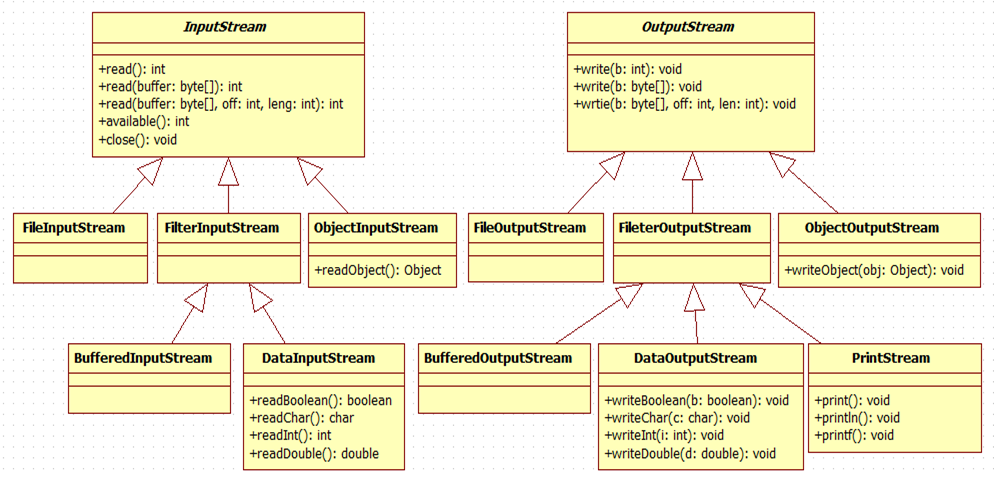

## 저장 

export - jar - generated class & java source files - 저장공간 지정 - main class 선택 : 완료

cmd 위치로 가서 : java -jar ams_서지원.jar

메모장 저장. bat -> editplus : start javaw -jar ams_서지원.jar 입력 후 실행 

# Graphic 

-------------

------------------

--------------

* Font : 폰트

* Color : 색상

* Graphics : 도형이나 이미지 등을 그릴 수 있는 도구들 

* Component : 그래픽 대상


* paint : 계속 오버라이딩 : 내가 할 수 있는게 별로 없음 - 제한적 

## Container Example : 대화상자 만들기

* 모달  : 대화상자 생기면 다른 창 모두 비활성화 (true)

* 비모달 : 대화상자 여부와 상관없이 모두 활성화 (false)

``` java
import java.awt.Dialog;
import java.awt.Frame;

	public static void main(String[] args) {
		Frame owner = new Frame();
		owner.setSize(400, 200);
		owner.setVisible(true);
		
		Dialog dialog = new Dialog(owner,"타이틀",false);
		dialog.setSize(200, 200);
		dialog.setVisible(true);
		
		Window window = new Window(owner); // -완전 그냥 흰 창
		window.setSize(400,200);
		window.setVisible(true);
		
		FileDialog fd = new FileDialog(owner, "파일열기", FileDialog.LOAD);
		FileDialog fd2 = new FileDialog(owner, "파일저장", FileDialog.SAVE);
		fd.setVisible(true);
		fd2.setVisible(true);
		//파일창이 딱 정해져있어서 setSize안해됨
	}
}

```

* 메뉴바 + 메뉴 + 메뉴 + 메뉴  ... 

* 메뉴아이템 : 메뉴바의 메뉴에서 나오는 선택지들 

``` java
//	메뉴 : 컴포넌트 
	MenuBar menuBar;
	Menu menu;
	MenuItem newMI, exitMI;

		menuBar = new MenuBar()	;
		menu = new Menu("File");
		newMI = new MenuItem("New");
		newMI.setShortcut(new MenuShortcut(KeyEvent.VK_N,true));
// 단축키 지정  : true - shift 누르고! 
		exitMI = new MenuItem("Exit");
		exitMI.setShortcut(new MenuShortcut(KeyEvent.VK_X,false));

//		현재 프레임에 : menu bar 붙이기
		setMenuBar(menuBar);
		menuBar.add(menu);
		menu.add(newMI);
		menu.addSeparator();
		menu.add(exitMI);
	// 액션 
		exitMI.addActionListener(new ActionListener() {
			
			@Override
			public void actionPerformed(ActionEvent e) {
				finish();
			}
		});
```

## Stream API 를 이용한 데이터 입출력프로그래밍

---------------

------------------

-------------------

* 입력 : 프로그램에서 특정 목적지의 데이터를 읽어 들이는 것 (Input)
* 출력 : 프로그램에서 특정 대상으로 데이터를 쓰는 것 (Output)

* 입력과 출력 사이의 빨대 역할


* Stream API의 특징
  * 입출력 대상에 상관 없이 일관된 방법으로 데이터를 읽고, 쓸 수 있다
  * 스트림은 단방향이다
    * 입력용과 출력용이 따로 만들어져 있다
  * 스트림은 FIFO 구조
* [특징]


[분류]

* 입력, 출력 스트림이 따로 있음

* 데이터를 바꾸고자 하는 종류 : 바이트 스트림/ 문제 스트림

* [스트림 API 구조]



* 입력, 출력 다름 : Input Stream , Output Stream 

  * 일관된 데이터 입출력 - 추상클래스 : 수직적 규격 

  <Input Stream

  read() : 1바이트씩 읽는 것 

  read(buffer:byte[]) : 배열로 읽는 것

  read(buffer:byer[],off:int,leng:int) : 배열인데 원하는 갯수만큼 읽어오는 것

  available : 몇개의 데이터를 읽을 수 잇는가 : file size.. 읽을 때 마다 하나씩 줄어듦

  close: file은 운영체제와 통신 - 계속 쌓이는 데이터 닫기

  ``` java
  import java.io.File;
  import java.io.FileInputStream;
  import java.io.FileNotFoundException;
  import java.io.IOException;
  import java.io.InputStream;
  
  public class InputStreamExample {
  	static final String path = "C:\\Users\\KOSTA\\Desktop\\epp500_0651_64bit.exe"; //파일 선택
  	
  	public static void main(String[] args)  {
  		InputStream in = null;
  		try {
  			in = new FileInputStream(path);
  			System.out.println(in.available()); // 바이트 수 확인
  			
  			// byte[](버퍼) 단위로 입력
  			byte[] buffer = new byte[4*1024]; // 4~6 키로 바이트가 일반적
  //			int count = in.read(buffer); //? 리턴타입이 count 냐 실제 데이터냐 를 잘 알아야함 
  //			System.out.println(count);
  //			System.out.println(buffer); // buffer가 배열이여서 클래스 이름 나옴
  //			for (byte b : buffer) {
  //				System.out.println(b);
  //			}
  			int count =0;
  			while((count=in.read(buffer))!=-1) {
                  // buffer,2,10 : buffer를 2번째 칸에 10개 읽겠다. 
                  //- default length
  				System.out.println(count);
  			}
  			System.out.println(in.available()); 
  			System.out.println("파일 다 읽었음"); //-> 저장시, 0부터 저장
  			
  			
  //			int b = in.read(); // 더이상 읽어들일 애가 없으면 -1 반환
  //			System.out.println(b);
  			
  //			int b = 0;
  //			while ((b= in.read())!= -1) {
  //				System.out.println(b);
  //			}
  			
  		} catch (FileNotFoundException e) {
  			// TODO Auto-generated catch block
  			e.printStackTrace();
  		} catch (IOException e) {
  			// TODO Auto-generated catch block
  			e.printStackTrace();
  		} finally {
  			try {
  				in.close();// 예외가 발생하던 안발생하던 종료는 해줘야함  : try 전에 null 지정
  			} catch (IOException e) {
  				// TODO Auto-generated catch block
  				e.printStackTrace();
  			} 
  		}	
  	}
  }
  ```

  BufferdInputStream : 순차적 접근 뿐 아니라 임의 접근 가능  
