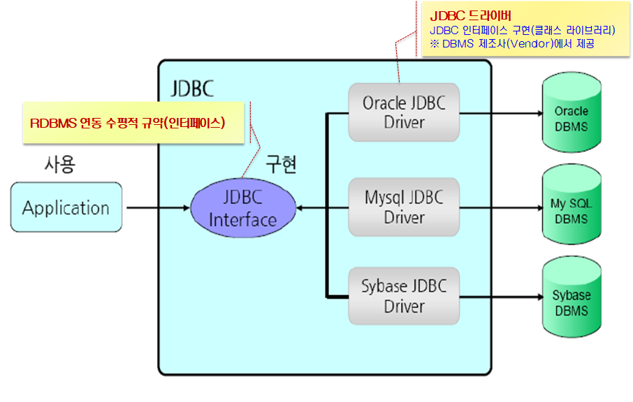
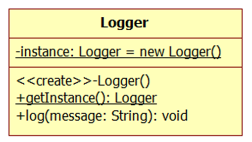
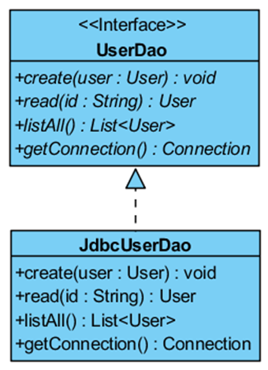

# 2018.09.27 DAY 24

-----------

-------------

## JDBC API 

* 자바 애플리케이션에서 관계형데이터베이스시스템에 네트워크로 연결하여 sql문을 실행하고, 실행결과를 쉽고, 유연하게 처리할 수 있도록 도와주는 표준api이다
* database연동을 위한 자바 인터페이스들과 클래스들의 집합
* 장점 : database종류에 상관없이 일관된 방법으로 쉽게 database에 연결할 수 있다.



* 인터페이스의 특징이 가장 잘 드러나있음 
* JDBC 인터페이스의 규격에 맞게 oracle, mysql, sybase... 에서 사용

#### 만들때 

* 일반 파일 만들기 - jar파일 옮겨놓기 - 우클릭 후 properties - jar파일 선택

``` java
public class JDBCExample {

	public static void main(String[] args) {
		String driver = "oracle.jdbc.OracleDriver";

		// #1.JDBC 드라이버 로딩(객체생성)
//		Driver driver = new OracleDriver() ;
		// Class 클래스를 이용한 동적 객체 생성
//		Class.forName(driver).newInstance(); //정상적인 호출
		try {
			Class.forName(driver);// 오라클에서 허용해줌
			System.out.println("JDBC");
		} catch (ClassNotFoundException e) {
			// TODO Auto-generated catch block
			e.printStackTrace();
		}
	}
}
```

``` java
		//#2. DBMS연결 
		String url = "jdbc:oracle:thin:@localhost:1521:xe";
		String username = "hr";
		String password = "hr";
		try {
			DriverManager.getConnection(url, username, password);
			System.out.println("DBMS 연결 완료...");
		} catch (SQLException e) {
			// TODO Auto-generated catch block
			e.printStackTrace();
		}
```


``` java
			//#3. sql 서버 전송 및 결과집합 수신
			Statement stmt = con.createStatement();
//			System.out.println(stmt);
			ResultSet rs = stmt.executeQuery(sql);
			// connection, statement, resultSet = jdbc
//			System.out.println(rs);
			
			//#4. ResulrSet에서 데이터 인출
//앞뒤로 bof, eof 있음
			while(rs.next()) {
//				rs.getString(0); //컬럼 순서
				String employeeId = rs.getString("employee_id");
				String lastName = rs.getString("last_name");
				int salary = rs.getInt("salary");
				System.out.println(employeeId + ","+ lastName + ","+ salary);
			}
			
```

```java
public class DQLExample {

	public static void main(String[] args)
			throws ClassNotFoundException, SQLException, InstantiationException, IllegalAccessException {
		String driver = "oracle.jdbc.OracleDriver";
		String url = "jdbc:oracle:thin:@localhost:1521:xe";
		String username = "hr";
		String password = "hr";

		String sql = "SELECT E.employee_id     id, \r\n" + "       E.last_name       ename, \r\n"
				+ "       E.salary          salary, \r\n"
				+ "       TO_CHAR(E.hire_date, 'YYYY-MM-DD HH24:MI:SS')       hiredate, \r\n"
				+ "       D.department_name dname \r\n" + "FROM   employees E \r\n" + "       join departments D \r\n"
				+ "         ON E.department_id = D.department_id ";

		Class.forName(driver).newInstance();

		Connection con = null;
		Statement stmt = null;
		ResultSet rs = null;

		con = DriverManager.getConnection(url, username, password);
		stmt = con.createStatement();
		rs = stmt.executeQuery(sql);

		while (rs.next()) {
			String id = rs.getString("id");
			String ename = rs.getString("ename");
			int salary = rs.getInt("salary");
//			Date hiredate = rs.getDate("hiredate");//날짜의 포맷은 자바에서 결정하는 것 X
			// oracle의 to_char로 하는 것
			String hiredate = rs.getString("hiredate"); // db를 to _char 해서 가져왔으니까 string으로 받아야함
			String dname = rs.getString("dname");
			System.out.println(id + ", " + ename + ", " + salary + ", " + hiredate + ", " + dname);
		}
		if (rs != null)
			rs.close();
		if (stmt != null)
			stmt.close();
		if (con != null)
			con.close();
	}
}
```

``` java

public class DMLExample {

	public static void main(String[] args) {
		String driver = "oracle.jdbc.OracleDriver";
		String url = "jdbc:oracle:thin:@localhost:1521:xe";
		String username = "hr";
		String password = "hr";

		String sql = "INSERT INTO departments \r\n" + "            (department_id, \r\n"
				+ "             department_name, \r\n" + "             location_id, \r\n"
				+ "             manager_id) \r\n" + "VALUES      (departments_seq.NEXTVAL, \r\n"
				+ "             'KOSTA', \r\n" + "             NULL, \r\n" + "             NULL) ";

		try {
			Class.forName(driver).newInstance();
		} catch (InstantiationException | IllegalAccessException | ClassNotFoundException e) {
			// TODO Auto-generated catch block
			e.printStackTrace();
		}

		Connection con = null;
		Statement stmt = null;

		try {
			con = DriverManager.getConnection(url, username, password);
			con.setAutoCommit(false);
			stmt = con.createStatement();
			int count = stmt.executeUpdate(sql); // 변경된 수를 알려줌 -- auto commit
			con.commit();
			System.out.println(count + "행이 추가되었습니다..");

		} catch (SQLException e) {
			e.printStackTrace();
			try {
				con.rollback();
			} catch (SQLException e1) {
				// TODO Auto-generated catch block
				e1.printStackTrace();
			}
		} finally {
			try {
				if (stmt != null)
					stmt.close();
				if (con != null)
					con.close();
			} catch (SQLException e) {
				e.printStackTrace();
			}

		}
	}
}
```

```java
// 메소드로 바꿔보자
// 비효율 구문

public class DMLExample {
	String driver = "oracle.jdbc.OracleDriver";
	String url = "jdbc:oracle:thin:@localhost:1521:xe";
	String username = "hr";
	String password = "hr";

	public void create(String departmentName, int managerId, int locationId) {
		String mId = "NULL";
		String lId = "NULL";
		if (managerId!= 0) {
			mId = managerId +"";
		}
		if (locationId!= 0) {
			lId = locationId +"";
		}
		
		String sql = "INSERT INTO departments \r\n" 
				+ "            (department_id, \r\n"
				+ "             department_name, \r\n" 
				+ "             location_id, \r\n"
				+ "             manager_id) \r\n" 
				+ "VALUES      (departments_seq.NEXTVAL, \r\n"
				+ "             '"+departmentName+"', \r\n" 
				+ "             "+mId+", \r\n" 
				+ "             "+lId+") ";
		Connection con = null;
		Statement stmt = null;

		try {
			Class.forName(driver).newInstance();
			try {
				con = DriverManager.getConnection(url, username, password);
				con.setAutoCommit(false);
				stmt = con.createStatement();
				int count = stmt.executeUpdate(sql); // 변경된 수를 알려줌 -- auto commit
				con.commit();
				System.out.println(count + "행이 추가되었습니다..");
			} catch (SQLException e) {
				// TODO Auto-generated catch block
				e.printStackTrace();
			}

		} catch (InstantiationException | IllegalAccessException | ClassNotFoundException e) {
			// TODO Auto-generated catch block
			e.printStackTrace();
			try {
				con.rollback();
			} catch (SQLException e1) {
				// TODO Auto-generated catch block
				e1.printStackTrace();
			} finally {
				try {
					if (stmt != null)
						stmt.close();
					if (con != null)
						con.close();
				} catch (Exception e2) {
					e2.printStackTrace();
				}

			}
		}

	}

	public static void main(String[] args) {
		DMLExample exam = new DMLExample();
		exam.create("코스타",0,0);
	}
}
```

``` java

/**
 * 동적 SQL 실행
 * 
 * @author 서지원
 *
 */
public class DynamicSQLExample {
	String driver = "oracle.jdbc.OracleDriver";
	String url = "jdbc:oracle:thin:@localhost:1521:xe";
	String username = "hr";
	String password = "hr";

	public void execute(String sql) {
		Connection con = null;
		PreparedStatement pstmt = null;
		ResultSet rs = null;

		try {
			Class.forName(driver).newInstance();
			con = DriverManager.getConnection(url, username, password);
			pstmt = con.prepareStatement(sql);
			boolean exists = pstmt.execute();
			if (exists) {
				rs = pstmt.getResultSet();
				ResultSetMetaData rsm = rs.getMetaData();
				int columnCount = rsm.getColumnCount();
				
				for (int i = 1; i < columnCount; i++) {
					String columnNames = rsm.getColumnLabel(i);
					System.out.print(columnNames + "\t");
				}
				while (rs.next()) {
					System.out.println("");
					for (int i = 1; i < columnCount; i++) {
						String columnName = rsm.getColumnLabel(i);
						String column = rs.getString(columnName);
						System.out.print(column+ "\t"+ "\t");
					}

				}
				
			} else {
				int count = pstmt.getUpdateCount();
				System.out.println(count + "행이 변경되었습니다..");
			}
		} catch (Exception e) {
			// TODO Auto-generated catch block
			e.printStackTrace();
		}

	}

	public static void main(String[] args)
			throws ClassNotFoundException, SQLException, InstantiationException, IllegalAccessException {
	DynamicSQLExample e = new DynamicSQLExample();
	e.execute("SELECT employee_id , last_name, salary \r\n" + 
			"FROM employees ");
	}
}
```

### 디자인 패턴

* 소프트웨어 시스템 설계 시 특정 상황에서 자주 발생하는 문제점들을 해결하기 위한 선배 개발자들의 설계 노하우를 종류별로 분류하여 정리하고, 이름을 붙여 놓은 재사용 가능한 설계 모델이다.
* 싱글톤패턴 - 메모리에 클래스 하나 만들어놓고 계속 재사용 : 객체의 생성과 관련된 패턴으로서 특정 클래스의 객체가 오직 한 개만 존재하도록 보장
* 
* 생성자에 private : new를 못하게 만듦---getInstance() : ex) 캘린더

### DAO 클래스 구현 시 디자인 패턴 적용

 DAO : 애플리케이션이 다루는 영속성 데이터를 전담하여 처리하는 객체

* DAO 디자인 패턴 
  * 영속성 데이터 처리를 위한 접근 기술들을 인터페이스를 통해 외부에 노출되지 않도록 설계하는 디자인 패턴 
  * DAO 객체에 데이터 전달 시 도메인 오브젝트(데이터 전달 목적 + 비즈니스 메소드) 또는 DTO(데이터 전달 목적)를 사용
  * cf) VO : Value Object - 분산 오브젝트까지 포함....

