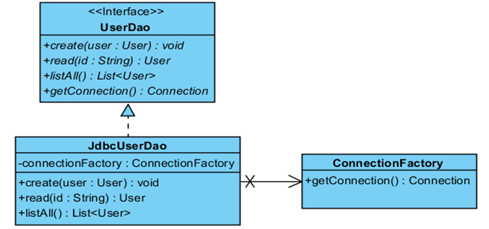

# 2018.09.29 DAY25

-----------------

----------

## 3단계 : Factory Method 패턴

* 템플릿 메소드 패턴 : 변하지 않는 개본적인 기능을 슈퍼클래스에 정의해 두고, 서브 클레스에 의해 변경되거나 확장 가능성이 높은 기능을 abstract 메소드(필수)로 선언하거나 hook 메소드(구현하고 싶으면 구현, 아니면 안해도 됨)로 정의해 둬서, 서브클래스에서 재정의하도록 하는 패턴

  

  ``` java
  public abstract class Super{
       // 템플릿 메소드
       public void templateMethod(){
            abstractMethod();
            hookMethod();
       }
       // 추상 메소드(서브클래스에서 반드시 재정의)
       public abstract void abstractMethod();
       // 훅 메소드(서브클래스에서 재정의 가능)
       public void hookMethod(){
            ……..
       }
  }
  ```

  * 로직의 기본을 위해 만듦 - 알고리즘

  * 객체생성 - 팩토리 메소드 

    https://jdm.kr/blog/116

* factory method 패턴
  * 상속을 통해 기능을 확장
  * 부모클래스에 사용하고자 하는 객체를 생성을 위한 팩토리 메소드를 추상으로 선언 후, 자식 클래스에서 다양한 생성 방법을 적용한 팩토리 메소드를 구현

## 커넥션 풀

* 직접 커넥션 풀을 사용할 class사용 or library 사용
* 클라이언트 요청 시점에 connection 을 연결하는 것이 아니라 미리 일정수의 connection 을 만들어 놓고 필요한 애플리케이션에 전달하여 이용하도록 하는 풀링 방법
* connection 을 갑작스럽게 많이 사용하게 될 경우 미리 설정된 최대 connection 수만큼 증가하도록 하여 원할한 서비스가 되도록 지원
* 설정할 경우, 보통 기본 connection 수 , 최대 connection 수, 필요 시 자동으로 증가하는 connection 수 등을 설정한다

* 아파치 www.apache.org
* DBCP libarary : data Source 구현 

* data Source : 다양한 데이터들을 저장하기 위한 기본 규격 + connection pooling 지원

## 4단계 : Connection 생성을 독립적인 클래스로 캡슐화

* 상속관계가 아닌 완전히 독립적인 클래스로 분리하여 작성

* 관심사가 다르고 변화의 성격이 다른 2가지 코드를 완벽히 분리

  

# 웹 개요 및 웹 표준(Web Standards)

* 인터넷 : 네트웍들이 모인 하나의 거대한 네트웍
* ip address 와 domain name과 같은 표준 주소체계를 사용
* 웹이란?
  * 정보자원들의 

* 웹1.0 : 단방향 
* 웹2.0 : 양방향 - 주고받음 : 비즈니스 모델을 가진 플랫폼으로서의 웹
* 웹3.0 : 웹을 SW의 플랫폼으로 봄
  * SaaS : Software as a Service

# 웹, HTML

### 기본

* 웹 브라우저에서 사용하는 파일은 *.HTML 또는 *.HTM 웹문서로 저장
* HTML 
  * 인터넷 서비스의 하나인 웹을 통해 전세계에 공유하고자 하는 웹 문서를 작성을 위한 마크업 언어
  * 공유를 위해 WEB SERVER의 웹 디렉터리에 저장되며, 웹 클라이언트에 다운되어 파싱되고, 렌더링됨

### 설치

* 톰캣설치 8.0.53

* port 변경

  ``` html
      <Connector port="80" protocol="HTTP/1.1"
                 connectionTimeout="20000"
                 redirectPort="8443" URIEncoding="utf-8"/>
      <!-- A "Connector" using the shared thread pool-->
      <!--
      <Connector executor="tomcatThreadPool"
                 port="8080" protocol="HTTP/1.1"
                 connectionTimeout="20000"
                 redirectPort="8443" />
      -->
      <!-- Define a SSL/TLS HTTP/1.1 Connector on port 8443
           This connector uses the NIO implementation that requires the JSSE
           style configuration. When using the APR/native implementation, the
           OpenSSL style configuration is required as described in the APR/native
           documentation -->
      <!--
      <Connector port="8443" protocol="org.apache.coyote.http11.Http11NioProtocol"
                 maxThreads="150" SSLEnabled="true" scheme="https" secure="true"
                 clientAuth="false" sslProtocol="TLS" />
      -->
  
      <!-- Define an AJP 1.3 Connector on port 8009 -->
      <Connector port="8009" protocol="AJP/1.3" redirectPort="8443" URIEncoding="utf-8"/>
  
  
  ```

* bin\startup 실행 후 localhost

* www.w3schools.com

  * 폴더 만들기

--docBase = webdirectory 의 경로

--path = 웹디렉토리를 식별하기위한 식별자이름 : 내가 정하는 이름

``` html
#server 수정 -- 이클립스에서는 자동으로 해줌
<Context docBase="c:/WebContents" path="/bangry"></Context>
      </Host>
    </Engine>
  </Service>
</Server>

```

