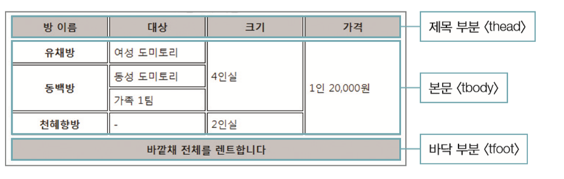
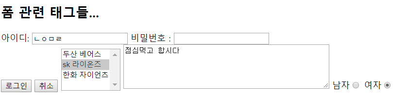

# 2018.10.01 Day 26

-----------

--------------


* head - meta charset & title 두개 필수 + a

# 자주 쓰는 기본 태그

* < hn >태그 - 일반 테스트보다 크기가 크고 진하게 표시

* < p >태그 - 입력한 내용 앞뒤로 빈 줄이 생기면서 텍스트 단락이 만들어진다

* < br > 태그 : 삽입한 위치에서 줄이 바뀐다

* < b > 태그: 감싼 텍스트를 진하게 표시

*  < i >태그 : 감싼 텍스트를 이탤릭체로 표시

* < img >태그 : 웹 문서에 이미지를 넣는 태그 

  태그 하나당 하나의 이미지. src 속성을 이용해 이미지 파일 경로를 표시해야 함 

* < a > 태그  : 다른 문서나 외부 사이트로 연결하는 하이퍼링크 만드는 태그 - 텍스트나 이미지를 감싸줌

``` html
<!DOCTYPE html>
<html>
<head>
<meta charset="utf-8">
<title>다이나믹 웹 프로젝트</title>
</head>
<body>
<h1>문서제목1</h1>
<h2>문서제목2</h2>
<h3>문서제목3</h3>
<h4>문서제목4</h4>
<h5>문서제목5</h5>
<h6>문서제목6</h6>
<p><b><i>이클립스</i>에서 <br>생성한 <i>html</i>문서 테스트...</b></p>
</body>
</html>
```


``` html
오늘은 피곤한 <b>월요일</b> 입니다.. <br>
오늘은 피곤한 <i><b>월요일</b></i> 입니다.. <br>

 <!--절대 경로 -->
 <!--상대 경로 -->
 <!--상대 경로 -->
 <!--상대 경로 -->
 <!--html앞에 / 안쓰면 오류 -->
 <!--다른 홈페이지에서 가져오기 -->
<a href="http://naver.com">네이버</a> <!-- 주소로 연결되어있음 -->
<a href="http://naver.com" title="네이버 사이트입니다...">네이버</a> <!-- 주소로 연결되어있음 -->

<a href="http://google.com" title="google로 연결하기.."></a>

```

### 설정 변경


## 텍스트와 하이퍼링크 관련 태그들

## 텍스트를 묶어서 처리하는 태그들

* < p > 태그 : 단락 만듦- 앞뒤 줄바꿈

* < blockquote > 태그 : 인용문 넣기 

*  < pre >태그 : 입력하는 그대로 화면에 표시

* < mark >태그 : 형광펜 효과내기 - 배경이 노란색

* < time >태그 : 날짜 또는 시간정보 저장

* < strong>, < em >, < b >, < i > 태그 

  * strong : 중요한 부분 굵게 표시
  * em : 중요한 부분을 이탤릭체로 표시

* < q > 태그 : 인용한 내용 표시 - 따옴표를 붙여 인용한 내용 표시

  * 줄바꿈 없이 다른 내용과 한 줄에 표시된다

* < sqan >태그 : 줄바꿈 없이 영역 묶기 - 텍스트 단락 안에서 줄바꿈 없이 일부 텍스트만 묶어서 스타일을 적용하려고 할때 주로 사용 - 나중에 CSS 속성 바꾸려고 만드는 것 : inline 태그 : 붙이면 계속  옆으로 붙음

* < div > 태그 : block 태그 : 한 줄 다 잡아먹음 

  ``` html
  <!DOCTYPE html>
  <html>
  <head>
  <meta charset="utf-8">
  <title></title>
  </head>
  <body>
  저는<blockquote>서지원 </blockquote>입니다.. 
  <pre>
  성공한 사업가들은 긍정적인 에너지를 주는 사람들이지 가져가는 사람들이 아니다. – 미상
  
  성공한 사람을 볼 때 당신은 대중에게 드러난 영예만 보지, 
  절대 그 영예를 얻기 위해 했던 개인적 희생은 보지 않는다. – 바입하브 샤
  </pre>
  <!-- xmp는 잘 안씀 --><xmp>
  성공한 사업가들은 긍정적인 에너지를 주는 사람들이지 가져가는 사람들이 아니다. – 미상
  
  성공한 사람을 볼 때 당신은 대중에게 드러난 영예만 보지, 
  절대 그 영예를 얻기 위해 했던 개인적 희생은 보지 않는다. – 바입하브 샤
  </xmp>
  
  나는<mark>서지원</mark>입니다<br>
  나는<marquee behavior="alternate">서지원</marquee>입니다<br>
  
  <time>2018-10-01</time>
  
  <!-- 아랫첨자 --><p>This is <sub>subscripted</sub> text.</p>
  <!-- 윗  첨자 --><p>This is <sup>superscripted</sup> text.</p>
  
  <!-- 강조글자 --><p>This is <q>강조글자</q> text.</p>
  <!-- 강조글자 --><p>This is &quot;강조글자&quot; text.</p>
  
  <!-- 강제적으로 띄고 싶을 때 -->서&nbsp;&nbsp;&nbsp;&nbsp;&nbsp;&nbsp;&nbsp;&nbsp;&nbsp;&nbsp;&nbsp;&nbsp;지원
  <!-- & 나타낼 때 --> &amp;
  <!-- <나타낼 때> --> &lt; 서지원 &gt;<br>
  
  안녕하세요. <span style="color: blue; background: yellow">서지원</span>입니다... <br>
  안녕하세요. <div style="color: blue; background: yellow">서지원</div>입니다...
  
  <h2 style="background: dodgerblue">색상 테스트</h2>
  <p style="background: rgb(255, 165, 0)">잘해봅시다.....</p>
  <p style="background: #ee82ee">잘해봅시다.....</p>
  
  </body>
  </html>
  ```


## 목록을 만드는 태그들

* < ul>, < li> 태그 : 순서 없는 목록
* < ol>, < li> 태그 : 순서 목록 

```html
<ul style="background: orange">
  <li style="background: blue">Coffee</li>
  <li>Tea</li>
  <li>Milk</li>
</ul>
<ol>
  <li>Coffee</li>
  <li>Tea</li>
  <li>Milk</li>
</ol>
<dl>
  <dt style="background: tomato">Coffee</dt> <!-- title -->
  <dd>- black hot drink</dd> <!-- contents -->
  <dd>- black hot drink</dd> <!-- contents -->
  <dd>- black hot drink</dd> <!-- contents -->
  <dd>- black hot drink</dd> <!-- contents -->
  <dd>- black hot drink</dd> <!-- contents -->
  <dt>Milk</dt>
  <dd>- white cold drink</dd>
</dl>
```


## 표 관련 태그들

* < table> ~ < /table> : 표 전체

* < tr> ~ < /tr> : 열 

* < td> ~ < /td> : 셀

* colspan / rowspan : 셀 합치기

* caption : 표에 캡션 넣기

* 여러 열 묶기 - col : 한 열에 있는 모든 셀을 묶음

  colgroup  : 여러 개의 col 태그를 묶어 그룹으로 스타일을 적용하기도 하고 span속성을 이용해 열을 묶기도 한다

* 표의 제목과 본문 구분해 주기
  * thread/ tbody/ tfoot



``` html
<!DOCTYPE html>
<html>
<head>
<meta charset="utf-8">
<title>표관련 예제</title>
</head>
<body>
  <table style="width: 800px; height: 400px; border: 1px dotted #ff0000;">
  <!-- 웬만하면 이렇게 하지 말기<table border="1" width="80%"> <table border="1" width="800"> : 픽셀 단위--> 
    <caption>우리반 명부</caption>
    <tr>
      <th>순번</th>
      <th>이름</th>
      <th>전화번호</th>
    </tr>
    <tr>
      <td>1</td>
      <td>서지원</td>
      <td>010.9919.4591</td>
    </tr>
    <tr>
      <td>2</td>
      <td>김지원</td>
      <td>010.9919.4591</td>
    </tr>
    <tr>
      <td>3</td>
      <td>이지원</td>
      <td>010.9919.4591</td>
    </tr>        
  </table>
  
  <table border="1">
  <tr>
    <th>Name</th>
    <th colspan="2">Telephone</th>
  </tr>
  <tr>
    <td>Bill Gates</td>
    <td>55577854</td>
    <td>55577855</td>
  </tr>
  </table>
  
  <table border="1">
    <tr>
      <th>Name:</th>
      <td>Bill Gates</td>
    </tr>
    <tr>
      <th rowspan="2">Telephone:</th>
      <td>55577854</td>
    </tr>
    <tr>
      <td>55577855</td>
    </tr>
  </table>
  
  <table>
    <colgroup>
      <col span="2" style="background-color:red">
      <col style="background-color:yellow">
    </colgroup>
    <tr>
      <th>ISBN</th>
      <th>Title</th>
      <th>Price</th>
    </tr>
    <tr>
      <td>3476896</td>
      <td>My first HTML</td>
      <td>$53</td>
    </tr>
  </table>
  
  <table>
    <thead>
      <tr>
        <th>Month</th>
        <th>Savings</th>
      </tr>
    </thead>
    <tbody>
      <tr>
        <td>January</td>
        <td>$100</td>
      </tr>
      <tr>
        <td>February</td>
        <td>$80</td>
      </tr>
    </tbody>
    <tfoot>
      <tr>
        <td>Sum</td>
        <td>$180</td>
      </tr>
    </tfoot>
  </table>
</body>
</html>
```


## 하이퍼링크

* 이미지링크

* 텍스트링크

* 메뉴링크

  < a
  href="연결할 문서나 사이트 경로">텍스트< /a >

* 새 창에서 링크 열기

  * target=“_blank”

# 폼과 관련된 태그들

## 폼 만들기

	< form [속성=“속성값”]> 폼 요소 < /form>

* form tag : panel역할을 함

## 정보를 입력하는 < input>태그


``` html
<!DOCTYPE html>
<html>
<head>
<meta charset="utf-8">
<title>폼관련 예제</title>
</head>
<body>
  <h2>폼 관련 태그들...</h2>
  <form action="xxx.jsp">
    아이디 : <input type="text" name="userid"><br>
    비밀번호 : <input type="password" name="userpw"><br>
    <!-- <input type="button" value="로그인" name="login"> -->
    <input type="submit" value="로그인" name="login"> <!-- 보내는 기능 같이 있는 버튼 -->
    <input type="reset" value="취소">
    <select name="teams" multiple><!-- ="multiple" & 값도 멀티플 -->
      <option>두산 베어스
      <option>sk 라이온즈
      <option>한화 자이언츠
    </select>
    
    <textarea name="" rows="5" cols="50">점심먹고 합시다</textarea>
  </form>
</body>
</html>
```



``` html
  <form action="xxx.jsp" method="post">
  <form action="xxx.jsp" method="get">
  <label>아이디: <input type="text" name="userid"></label>
  <label>비밀번호 : <input type="password" name="userpw"></label><br>
      
         
    <label>남자<input type="radio" name="gender"></label>
    <label>여자<input type="radio" name="gender" checked></label>
    
    <input type="hidden" name="some" value="test"> <!-- 안보이는 애 -->
```

### 창 나누기


```html
<!DOCTYPE html>
<html>
<head>  
<meta charset="utf-8">
<title></title>
<frameset rows="10%,*,25%">
    <frame src="aExample.html">
    <frame src="FormExample.html">
    <frame src="hello.html">
  </frameset>
</head>
    <body></body>
</html>
```


``` html
<!DOCTYPE html>
<html>
<head>  
<meta charset="utf-8">
<title></title>

</head>
<body>
문서내용... <br>
<iframe src="http://www.daum.net" frameborder="0" scrolling="yes"></iframe>
문서내용... 
</html>
```

## 메타 태그

```html
<!DOCTYPE html>
<html>
<head>  
<meta charset="utf-8">
<head>
  <meta charset="UTF-8">
  <meta name="description" content="Free Web tutorials">
  <meta name="keywords" content="HTML,CSS,XML,JavaScript">
  <meta name="author" content="John Doe">
  <!-- <meta http-equiv="refresh" content="30">  : 30초 단위로 계속 업데이트 되게 하는 애-->
</head>
<title>메타태그</title>
</head>
<body>

문서내용..

</html>
```

정보를 가지고 있음

--------------

# 웹 애플리케이션의 역할 : HTML5의 등장

-----------

* GOOGLE의 등장 - 웹표준과 Ajac로 웹에 대한 새로운 시각

  * 개발자와 디자이너간의 역할 분담
  * 유지보수 및 높은 생산성
  * 뛰어난 웹접근성
    * 다양한 웹서비스를 선보이기 시작하였지만 표준화되어있지 않음

  -->  순수 마크업과 API만으로 웹애플리케이션을 만듦 : HTML5의 등장

* Web Document에서 Web Application을 위한 플랫폼으로 진화

* W3C (HTML W/G, WEBAPPS W/G), WHATWG에서 각각 표준화 진행

  

