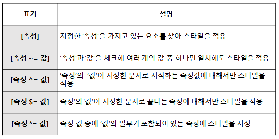
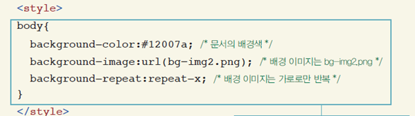

<style>
h1 {
    text-shadow: 2px 2px 5px red;
}
    h2 {
        text-shadow: 2px 2px gold;
        font-family: 나눔고딕코딩:
    }
</style>
<h1>  </h1>

# 2018.10.02 DAY27

------------

------------

## HTML5 페이지 구조

* lang속성 - 해당 웹 페이지가 어떠한 언어로 만들어져 있는지 인식

## 오디오 태그

* html5 에서 추가된 기능

* 웹 브라우저에서 음악을 재생할 수 있게 해준다

  ``` html
  <body>
      <audio src="Kalimba.mp3" controls="controls"></audio>
      ! controls: 얼마나 들었는지 바 나오는거
  </body>
  ```

* 오디오 태그가 가지는 속성

* source 속성 - 웹 브라우저마다 지원하는 음악 파일의 형식이 다르기 때문

``` html
<body>
    <audio controls="controls">
    	<source src="Kalimba.mp3" type="audio/mp3"/>
       <source src="Kalimba.mp3" type="audio/ogg"/> 
    </audio>
</body>
```

## 비디오 태그

* html5에서 추가된 기능
* 웹 브라우저에서 영상을 재생할 수 있게 해줌
* 웹 브라우저 별로 지원하는 동영상 팡리 형식이 다름

``` html
<body>
    <video controls="controls">
    	<source src="Wildlife.mp4" type="video/mp4"/>
        <source src="Wildlife.webm" type="video/webm"/>
    </video>
</body>
```

## 공간 분할 태그

* 레이아웃을 생성할 때 사용

* div 태그 : 블록 형식으로 공간 분할

  ``` html
  <body>
      <div>Lorem ipsum</div>
      <div>Lorem ipsum</div>
      <div>Lorem ipsum</div>
      <div>Lorem ipsum</div>
      <div>Lorem ipsum</div>
  </body>
  ```

* span 태그 : 인라인 형식으로 공간 분할

  ``` html
  <body>
      <span>Lorem ipsum</span>
      <span>Lorem ipsum</span>
      <span>Lorem ipsum</span>
      <span>Lorem ipsum</span>
      <span>Lorem ipsum</span>
  </body>
  ```

* 시멘틱 태그

  어떠한 태그가 어떠한 기능을 하는지 분별가능

  웹페이지에서 데이터를 효율적으로 추출

# CSS (cascade style sheet)

## 스타일 

* html 문서에서 자주 사용하는 글꼴이나 색상, 정렬 등 각 요소들의 배치 방법 등 문서의 서식을 결정짓는 내용들
* 스타일 시트 : 스타일을 관리하기 쉽도록 한 군데 모아놓은 것

## 스타일의 형식

 * inline 형식

   ``` html
   <!DOCTYPE html>
   <html>
   <head>
   <meta charset="utf-8">
   <title>CSS를 HTML에 적용하기 - 3가지 방법(인라인)</title>
   </head>
   <body style="font-family: 궁서체">
   
   <h2 style="font-size: 40pt; font-family: 돋움; color: orange;">오늘의 명언</h2>
   <p style="font-size: 20pt;  color: tomato; font-style: bold;">열정은 사람을 현재에 완전히 가둬서 그에게 시간은 매 순간 이 단절된 '현재'의 연속이 된다.</p>
   <p style="font-size: 20pt;  color: tomato; font-style: bold;">열정은 사람을 현재에 완전히 가둬서 그에게 시간은 매 순간 이 단절된 '현재'의 연속이 된다.</p>
   
   
   </body>
   </html>
   ```

   

 * 임베디드 형식

   ``` html
   <!DOCTYPE html>
   <html>
   <head>
   <meta charset="utf-8">
   <title>CSS를 HTML에 적용하기 - 3가지 방법(임베디드방식)</title>
   <style type="text/css">
   h2 {
   	font-family: 돋움;
   	font-size: 40pt;
   	color: orange;
   }
   
   p { /*CSS선택자 - Selector*/
   	font-size: 20pt;
   	color: red;
   	background-color: gold;
   	font-family: 궁서체;
   }
   </style>
   </head>
   <body>
     <h2>오늘의 명언</h2>
     <p>열정은 사람을 현재에 완전히 가둬서 그에게 시간은 매 순간 이 단절된 '현재'의 연속이 된다.</p>
     <p>열정은 사람을 현재에 완전히 가둬서 그에게 시간은 매 순간 이 단절된 '현재'의 연속이 된다.</p>
   </body>
   </html>
   ```

   

 * css파일 (외부 스타일)

   ``` html
   /*@charset "utf-8"; - meta set : default가 utf-8이어서 안써도 됨*/
   
   h2 {
   	font-family: 돋움;
   	font-size: 40pt;
   	color: orange;
   }
   
   p { /*CSS선택자 - Selector*/
   	font-size: 20pt;
   	color: red;
   	background-color: gold;
   	font-family: 궁서체;
   }
   ```

   ``` html
   <!DOCTYPE html>
   <html>
   <head>
   <meta charset="utf-8">
   <title>CSS를 HTML에 적용하기 - 3가지 방법(파일형)</title>
   <!-- <link rel="stylesheet" type="text/css" href="css/common.css"> -->
   <style type="text/css">
   @import url("css/common.css");
   </style>
   </head>
   <body>
     <h2>오늘의 명언</h2>
     <p>열정은 사람을 현재에 완전히 가둬서 그에게 시간은 매 순간 이 단절된 '현재'의 연속이 된다.</p>
     <p>열정은 사람을 현재에 완전히 가둬서 그에게 시간은 매 순간 이 단절된 '현재'의 연속이 된다.</p>
   </body>
   </html>
   ```

   ## 스타일의 우선 순위

   * 스타일은 상속된다
   * 스타일은 단계적으로 적용된다

# 속성이 사용되는 곳을 표시하는 선택자

## 전체 선택자. 태그 선택자

* 선택자, 셀렉터(selector)

  * 스타일을 적용하기 위해 특정한 부분을 선택하는 방법

* 전체 선택자

  * 페이지에 있는 모든 요소를 대상으로 스타일을 적용할 때 사용

  * 다른 선택자와 함께 모든 하위 요소에 한꺼번헤 스타일을 적용하려고 할 때 주로 사용

    ```html
    * { margin:0; padding:0;}
    ```

* 태그 선택자

  * 문서 안의 특정 태그에 스타일이 모두 적용됨

    ``` html
    p { font-size:12px; font-family:“돋움”; }
    ```

## class 선택자, id 선택자

* 클래스 선택자 : 문서 안에서 여러 번 반복할 스타일이라면 클랙스 선택자로 정의, 마침표 다음에 클래스 이름 지정 <b>태그와 상관없이 grouping해줌</b>
* id 선택자 : 문서 안에서 한번만 사용한다면 id 선택자로 정의, 파운드(#)다음에 id 이름 지정

## 하위 선택자, 자식 선택자

* 하위 선택자 : 부모 요소에 포함된 모든 하위 요소에 스타일이 적용된다. 하위 선택자를 정의할 때는 상위 요소와 하위 요소를 나란히 쓴다

  ``` html
  section p { color:blue; }
  ```

* 자식 선택자 : 부모요소의 자식 요소에만 스타일이 적용된다

  ``` html
  section > p { color:blue; }
  ```

## 인접 형제 선택자, 형제 선택자

* 인접 형태 선택자 : 문서 구조상 같은 부모를 가진 형제 요소 중 첫번째 동생 요소에만 스타일 적용, 같은 부모요소를 가지는 요소들을 형제관계라고 부르는데, 먼저 나오는 요소를 '형 요소', 나중에 나오는 요소를 '동생 요소'라고 한다

  ``` html
  h1 + p { text-decoration : underline; }
  ```

* 형제 선택자 : 형제 요소들에 스타일 적용. 모든 형제 요소에 다 적용

  ``` html
  h1~p { text-decoration : underline; }
  ```

## 그룹 선택자

* 하위 선택자 : 같은 속성을 적용해야 할 경우 똑같은 스타일을 두 번 정의하지 않고 한번에 묶어서 정의, 쉼표로 선택자 구분

  ``` html
  a, p { color: #fffff; }
  ```

## 속성 선택자 



## 가상 클래스


# <<텍스트>>

---------------

# 글꼴과 관련된 스타일

## font-family

``` html
p { font-family: 굴림; }
```

* 지정한 글꼴이 없을 경우를 대비해 두 번째, 세 번째 글꼴까지 지정할 수 있다. 

* 둘 이상의 글꼴 이름을 지정할 때는 글꼴 이름과 글꼴 이름 사이에 쉼표로 구분한다

  ``` html
  body { font-family:"맑은 고딕", "돋움", "굴림" }
  ```

## font-size와 px, em, 백분율

* 사용할 수 있는 값 : 절대 크기, 상대 크기, 숫자, 백분율
* 기본 값 : medium
* 속성은 상속된다.
* 상대 크기 : xx-small<x-small<small<medium<large<x-large<xx-large
* em : 선택한 글꼴의 대문자 M의 너비를 기준으로 함

## font-style

* 글자를 이탤릭체로 표현할 것인지의 여부를 결정

## font-variant

* 영문 소문자를 작은 대문자로 표시

* 작은 대문자는 원래 대문자와 비슷하게 보이지만, 크기가 작고 글자의 가로, 세로 비율이 약간 다르다

  ``` html
  h1 { font-variant: small-caps; }
  
  <h1> 1st level heading using h1 tag  </h1>
  <h2> 2nd level heading using h2 tag  </h2>
  ```

## font-weight

* 글자의 굵기 지정, 사용할 수 있는 값은 키워드와 숫자

  ``` html
  .accent { font-wieght:bold; }
  <p> 일반적인 텍스트 단락  </p>
  <p class="font1"> bold로 지정했을 때  </p>
  <p class="font2"> 500으로 지정했을 때  </p>
  <p class="font3"> 900으로 지정했을 때   </p>
  ```

# 텍스트와 관련된 스타일

## text-align

* 문단의 텍스트 정렬 방법 지정

* 텍스트에 그림자 효과를 추가해서 텍스트를 좀더  입체적으로 보이게 속성 값을 조정하면서 글자가 더욱 선명하게 보이도록 할 수도 있다.

* 마치 그래픽으로 처리한 듯한 텍스트도 가능

* =-------------------

* -------------------

* 등등 

* 

# 색상과 배경 관련 스타일

# background-color

* 웹 문서의 요소에 배경색 지정
* 문서의 배경색은 상속되지 않음

## background-image

* 배경 이미지 지정
* 배경 이미지 반복 여부와 반복 방향 지정 
  * repeat : 가득찰 때까지 배경 이미지 가로와 세로로 반복. 기본값
  * repeat-x : 배경이미지를 가로로 반복, y: 새로로 반복
  * no-repeat : 배경이미지 반복하지 않음

* 배경 이미지를 반복하지 않고 한번만 표시할 경우에 특정한 위치에 배경 이미지를 배치할 수 있음

   

## background-attachment

* 배경 이미지 고정
  * scroll : 배경 이미지도 내용 따라서 스크롤 됨 
  * fixed : 배경 이미지가 고정되어 스크롤 되지 않음
* 배경과 관련된 속성을 한꺼번에 줄여서 표현

## background-size

* 요소 크기에 따라 배경 이미지를 여러 가지 크기로 사용

  

## background-clip

* 배경 이미지나 배경색을 어디까지 적용할지 범위 지정
  * border-box : 테두리 부분까지 적용
  * padding-box : 패딩 부분까지 적용
  * content-box : 마진 부분까지 적용

## background-origin

* 배경 이미지 위치의 기준을 어디로 할지 지정

  * border-box : 박스 모델의 가장 외곽인 테두리(border)까지 포함해서 기준

  * paddign-box : 테두리를 빼고 패딩 (padding) 범위 안에서 기준
  * content-box : 내용 부분만 기준  border-box : 박스 모델의 가장 외곽인 테두리(border)까지 포함해서 기준

# <<레이아웃 관련 스타일>>

-----------

# 박스 모델

* css의 박스 모델

* 그림이나 텍스트처럼 사각 영역을 갖는 요소들

* 박스 모델 스타일을 이용하면 여백이나 테두리 등을 자세히 설정할 수 있다

  --> 웹 문서에서 다양하게 활용


## width, height 속성 - 박스모델 크기 지정하기

* 박스모델은 마진이나 패딩을 이용해 적절한 크기를 만든다
* 필요하면 width속성/ height 속성을 사용해 크기를 정할 수 있다.

# 마진(margin)

* 요소 주변 여백
  * margin-top, margin-right, margin-bottom, margin-left (요소의 바깥 위쪽 마진, 오른쪽 마진, 아래쪽 마진, 왼쪽 마진)
  * margin(네 방향의 마진을 한꺼번에 지정)

## 패딩

* 콘텐츠 영역과 테두리 사이 여백

* padding (네 방향의 패딩을 한꺼번에 지정)

  padding-top, padding-right, padding-bottom, padding-left
   (박스의 위쪽 패딩과 오른쪽 패딩, 아래쪽 패딩, 왼쪽 패딩)

* 

---------------

# CSS3의 박스 관련 속성들

``` html
<style>
   .content1 {    border-radius:10px; } 
   .content2 {    border-radius:30px; } 
</style>
```


## 블록 레벨과 인라인 레벨 요소

* 블록 레벨 요소
* 인라인 레벨 요소

## display

* 해당 요소가 화면에 어떻게 보여질 것인지 지정

  * block : 블록 레벨 요소로 만든다
  * inline : 인라인 레벨 요소로 만든다
  * inline-block : 블록 레벨 박스지만 인라인 레빌 박스처럼 배치
  * none : 화면에 표시하지 않는다
  * inherit : 상위 요소의 display 속성 상속

  ``` html
  <!DOCTYPE html>
  <html>
  <head>
  <meta charset="utf-8">
  <title>박스모델의 display 속성</title>
  <style type="text/css">
  span {
  	background-color: gold;
  }
  
  div {
  	background-color: tomato;
  }
  </style>
  </head>
  <body>
  	<span>Inline-Box</span>
  	<span>Inline-Box</span>
  	<span>Inline-Box</span>
  	<span>Inline-Box</span>
  	<div>Block-Box</div>
  	<div>Block-Box</div>
  	<div>Block-Box</div>
  	<div>Block-Box</div>
  	<div style="display: inline;">Block-Box를 inline으로 변경</div>
  	<span>Inline-Box</span>
  	<span style="display: block;">Inline-Box를 Block으로 변경</span>
  	<div style="display: none;">Box를 안보이게</div>
  	<div>마지막 Box</div>
  </body>
  </html>
  ```

  

## positon

* 웹 문서 안의 요소들을 자유자재로 배치해 주는 속성
* 웹 문서를 만들 때 중요하게 사용하는 속성 중 하나 
  * static : 요소를 문서의 흐름에 맞춰 배치
  * relative : 이전 요소에 자연스럽게 연결해서 배치
  * absolute : 원하는 위치를 지정하여 배치
  * fixed : 지정한 위치에 고정해서 배치. 요소가 화면에서 잘릴 수도 있음

## visibility

* 특정 요소를 화면에 보이거나 보이지 않게 설정하는 속성
* visibility : hidden 
  * 요소를 화면에서 감춘다
  * 실제로는 공간을 차지하고 있다
  * 다른 요소들을 배치할 때 화면에 보이지 않는 요소도 고려

## z-index

* 요소 쌓는 순서 정하기

* z-index 값이 크면 값이 작은 요소보다 위에 쌓인다

* z-index 값을 명시하지 않으면 1부터 시작해서 1씩 커진다


## float 

* 웹 요소를 문서 위에 떠 있게 한다. 문서의 레이아웃 지정
* float: left; - 문서의 왼쪽으로 배치
* float: right; - 문서의 오른쪽으로 배치