<style>
    h1 {
    text-shadow: 2px 2px 5px red;
	}
    h2 {
        text-shadow: 2px 2px gold;
    }
</style> 
<h1> </h1>

------------

# 2018.10.04 DAY28

--------------

# 반응형 웹 디자인(Responsive Web Design)


# 자유자재로 변하는 반응형 웹 디자인

* 원래 웹사이트 내용을 그대로 유지하면서 다양한 화면 크기에 맞게 웹사이트를 표시하도록 함


# 미디어 쿼리

* 사이트에 접속하는 기기에 따라 특정한 CSS스타일을 적용하도록 함

* 뷰포트 너비 같은 여러 장치들의 조건에 맞춰 특정한 CSS 스타일을 지정

  ``` html
  @media [ONLY | NOT]  미디어 유형 [AND 조건] * [AND 조건]
  ```

  * 대소문자를 구별하지 않는다

  * 기본으로 미디어 유형이 지정되어야 하고, 필요할 경우 AND 연산자로 조건을 적용

  * ONLY : 미디어 쿼리를 지원하지 않는 웹 브라우저에서는 미디어 쿼리를 무시하고 실행하지 않는다

  * NOT: NOT다음에 지정하는 미디어 유형을 제외한다

  * @media : 이 속성 다음에 미디어 유형을 지정 -- all, print, screen, tv, ... 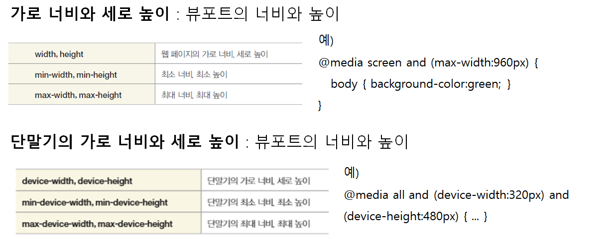

    * 대부분 max 와 min으로 크기 지정

    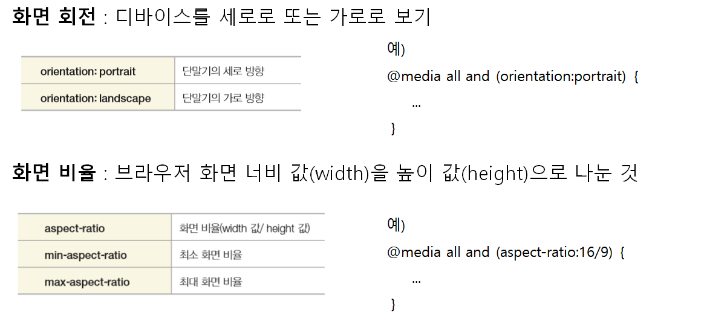

    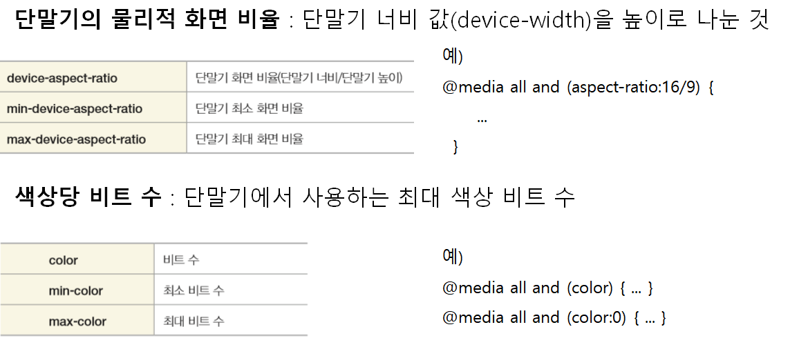

    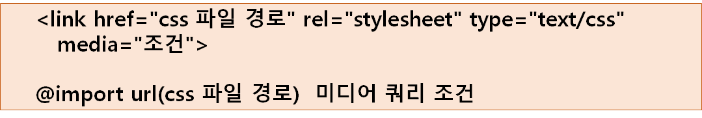

  * 각 조건별로 스타일시트 파일을 따로 저장한 후, < link> 태그나 @import 문을 사용해서 CSS 파일 연결

    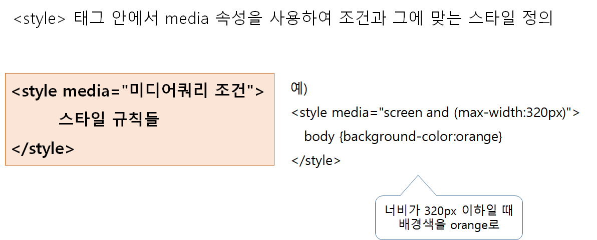

    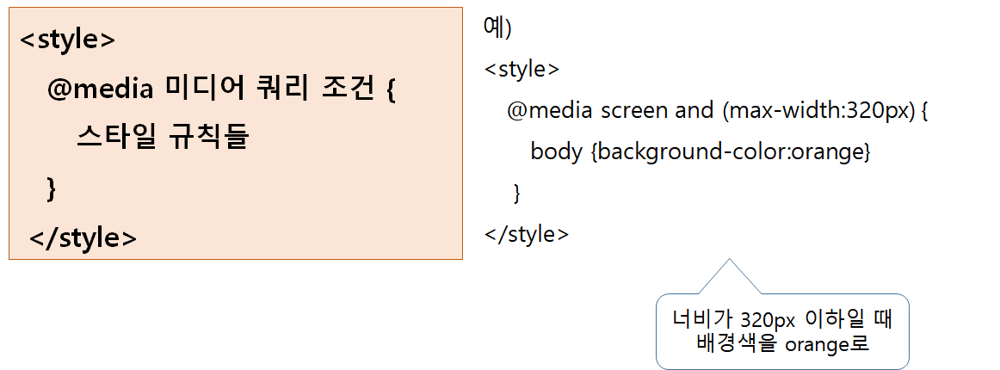

  * N개 필요하면 - N개 연결

    ```html
    <!-- 예) 너비가 321px 이상 768px 이하일 때 태블릿 PC용 tablet.css를 사용하도록 -->
    
    <link href="css/tablet.css" rel="stylesheet" type="text/css" media="screen and (min-width:321px) and (max-width:768px)"> 
    
    @import url(“css/tablet.css") screen and (min-width:321px) and (max-width:768px);
    
    ```

## 뷰포트

* 스마트폰 화면에서 실제 내용이 표시되는 영역

* 모바일 브라우저의 기본 뷰포트 너비 980px

  * 웹 페이지를 모조건 980px 너비로 표시하려고 하기 때문

    * 320px너비로 맞춰 모바일 사이트를 제작해도 스마트폰을 보면 아주 작게 표시됨

     <B>-->뷰포트 크기나 배율을 조절해야함</b>

    ```html
    <meta name="viewport" content="width=device-width">
    <!-- 
    기본형 : <meta name=="viewport" content="속성1=값, 속성2=값2, ...... "> 
    -->
    ```

  * 반응형 쿼리 - 메타 태그(뷰포트) & 미디어쿼리 둘 다 이용해야함


# 미디어쿼리를 적용하는 방법

----------------------

# 자바 스크립트 소개

## 자바 스크립트 소개

* 동적인 웹 페이지 작성을 위해 html 문서 내에 코드를 삽입하여 사용하는 대표적인 Scripting Language 이다
* 컴파일 과정을 거치지 않고 브라우저에 의해 직접 실행됨
* 변수, 연산자, 제어문, 함수 등과 같은 프로그램 기본 구성 요소와 객체를 지원
* JavaScript는 특정 데이터 연산, 입력 폼 데이터에 대한 유효성 검증, 이벤트 처리, 서버 프로그램과의 데이터 통신에 주로 사용됨
* JavaScript 와 Java는 이름이 유사하지만 완전히 다른 프로그래밍 언어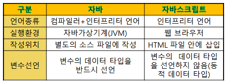
* ECMScript 라는 이름으로 표준 채택

## 특징

* <b>인터프리터 언어</b> – 컴파일 과정을 거치지 않고 바로 실행시킬 수 있는 언어이다(빠르게 개발 가능하지만 디버깅이 어렵다)

* <b>동적 타이핑(Typing)</b> – 변수의 데이터타입을 선언하지 않고도 변수를 사용할 수 있다. 단순히 모든 변수는 var x;와 같이 선언한다.

* <b>절차적 프로그래밍 지원</b> – C언어의 절차적 프로그래밍 지원한다. 즉 if, while, for 등의 제어 구조를 완벽하게 지원한다.

- <b>객체 지향 프로그래밍 지원</b> – 자바스크립트는 자바 언어와 달리 클래스 기반이 아닌 프로토타입(prototype:원형) 기반 객체지향언어이다.

## javaScript활용

* 동적 html 화면을 만들 수 있다
* 사용자의 이벤트를 처리할 수 있다
* html이나 css의 내용을 변경할 수 있다
* 폼 입력 데이터에 대한 유효성 검증 작업을 할 수 있다
* 서버 프로그램(Servlet, jsp, php 등 )과의 데이터 통신을 할 수 있다

## css와 마찬가지로 3가지 방법으로 html 문서에 삽입 가능

* 인라인 자바스크립트

  ``` html
  <a href="JavaScript:alert('메시지');">클릭</a>
  <input type="button" value="버튼" onclick=“[JavaScript:]alert('메시지');“>
  ```

  문서 작성하면서 주로 확인할 때 사용

* 내장(임베디드) 자바스크립트

  ```html
    <!-- 스크립트 선언 -->
    <script type="text/javascript">
  			//식별자 , 키워드, 변수, 데이터타입, 연산자, 제어문, 함수, 객체
  			document.write("<h2>안녕, 자바스크립트...</h2>");
  			document.write("<p>서지원입니다...</p>");
  			document.write(50 + "<br>");
  			document.write(true);
  			document.write(false);
  		</script>
  ```

* 외부 자바스크립트(*.js)파일 작성 및 참조 방식 : 자주쓰는 함수들 head에 등록

  ```html
  <html>
  <head>
     <script type=“text/javascript” src=“/js/common.js”></script>
  </head>
  <body>
     <script>
     // 자바스크립트 공통 파일의 함수 사용
     </script>
  </body>
  </html>
  
  ```

``` html
<script type="text/javascript">

var message = new String("점심먹고 합시다...");
console.log("charAt" in message);
console.log("xxx" in message);

</script>
```

## JavaScript 기본 출력 방법

* alert("문자열"); - 웹 브라우저에 경고창에 문자열 출력

* document.wirte("문자열"); - 문서(Document)에 문자열 출력

* console.log("문자열"); - 웹 브라우저 콘솔에 문자열 출력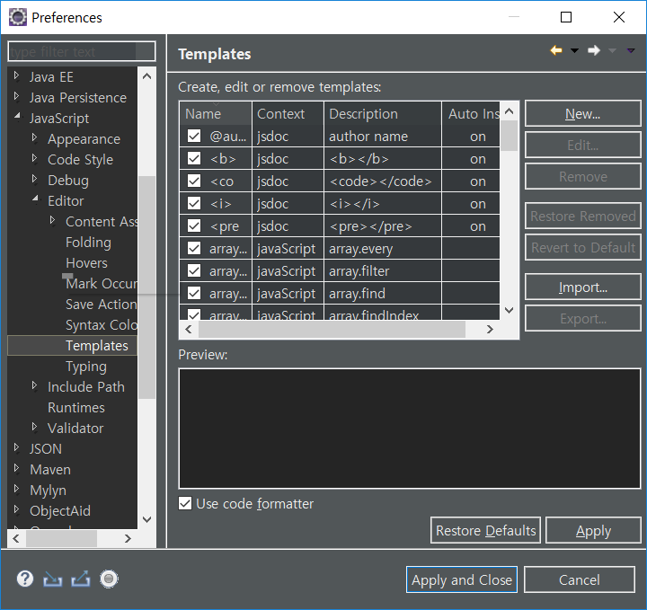

  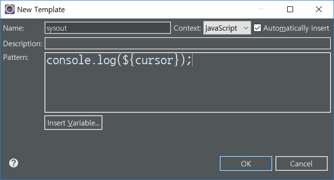

  ``` html
  <script type="text/javascript">
  document.write("출력 문자열 입니다<br>");
  alert("경고 메시지...");
  var result = confirm("밥은 먹고 다니냐?");
  document.write(result);
  
  var name = prompt("이름이 뭐야");
  document.write(name);
  
  console.log('콘솔에 출력');
  
  </script>
  ```


## 변수

* 기본형 - string, number, boolean
* 레퍼런스형 - 객체

```html
<script type="text/javascript">
			//변수 선언
			//기본 데이터 타입
			var name;
			document.write(name);
			name = ''; //문자나 문자열 모두 ''로 씀 
			name = "서\"지원";
			name = '나는 "서지원"입니다'; //String

			document.write(name);
			var a = 10, b = 20, c = 30; //number
			var flag = true; //boolean
			document.write(flag);

			//레퍼런스 타입 - 객체 : 참조값을 가짐
			var message = new String("나는 래퍼런스 타입 문자열 객체입니다.");
			document.write(message);
			document.write(message.length);

			//변수 Overwrite 가능
			var a = 1000;
			document.write(a);

			//동적 타이핑
			name = 5000;
			document.write(typeof name);
			name = false;
			document.write(typeof name);
		</script>
```

## overWrite

``` html
  <script type="text/javascript">
		/*	//함수선언 -- head 에 썼던거 또 써도 괜츈 -> 오버라이트 됨
			function sum(x, y) {
				return x + y;
			}*/

			var x = 50, y = 40;
			var result = sum(x, y);
			document.write(result);
		</script>
```

## undefined VS null

* undefined : 변수가 선언되지 않았거나(존재하지 않음), 초기화 되지 않았음을 나타내는 자료형
* null : 변수에 객체가 할당되지 않았음을 나타내는 특수한 값
  * undefined 가 더 넓은 의미

## 기본 자료형과 레퍼런스 자료형

* 기본자료형(문자열,숫자, 논리값) 각각에 대응하는 객체가 정의됨 : 래퍼객체(String, Number, Boolean)

* 래퍼객체는 기본자료형을 포장하여 다양한 메소드를 제공

* 기본 자료형의 프로퍼티나 메소드를 접근하려고 할 때, 스크립트 엔젠에 의해 임시 생성되며(Auto Boxing), 접근이 끝나면 다시 기본 자료형으로 복원됨

  * == : 기본값과 Wrapper객체를 동등하게 비교

  * === : 기본값도 Wrapper 객체를 구별

    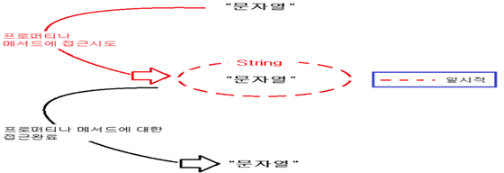

    ``` html
    <script type="text/javascript">
    var message = "김기정입니다...";
    var age = 30;
    var flag = true;
    
    console.log(message);
    console.log(typeof message);
    console.log(age);
    console.log(typeof age);
    console.log(flag);
    console.log(typeof flag);
    console.log(message.charAt(0)); // 잠시 객체로 바뀜 -> .charAt 가능한 걸 보니! (효율적으로 메모리 관리)
    console.log(typeof message);
    
    var message2 = new String("김기정입니다..."); //객체
    console.log(typeof message2);
    
    console.log(message==message2);
    console.log(message===message2);
    
    </script>
    ```


## in 연산자

									

* 좌변 값이 우변 객체의 프로퍼티 이름에 해당하면 true

## delete 연산자

* 단항 연산자로 피연산자로 지정된 객체 프로퍼티, 배열 원소 또는 변수의 삭제 시도
* 삭제되어서 존재하지 않는 객체 여부를 검사하려면 in 연산자를 활용
* 배열을 삭제하면 빈자리로 남는다
* 피연산자로 좌변값이 오지 않으면 true 반환, 성공적으로 삭제시 true 반환

## 조건문

* if 문

  		

  		

  ```html
  <script type="text/javascript">
  			var score = prompt("성적을 입력하세요", 0); // string으로 받음 + 초기값 지정
  			//score = parseInt(score); //number로 변환
  			//console.log(score);
  			console.log(typeof score); //값 : number
  			if (score >= 90) {
  				console.log("수");
  			} else if (score >= 80) {
  				console.log("우");
  			} else if (score >= 70) {
  				console.log("미");
  			} else if (score >= 60) {
  				console.log("양");
  			} else {
  				console.log("가");
  			}
  
  			console.log(10 * "10"); //값 : 100
  			//자동형변환 일어남 
  			console.log(10 + "10"); // 값 : 1010
  		</script>
  ```

* switch문

  ```html
  <script type="text/javascript">
  			var score = prompt("성적을 입력하세요", 0); // string으로 받음 + 초기값 지정
  			//score = parseInt(score); //number로 변환
  			//console.log(score);
  			console.log(typeof score); //값 : number
  			switch (
  			Math.floor(score/10)) {
  			case 10:
  			case 9: console.log("수");break;
  			case 8: console.log("우");break;
  			case 7: console.log("미");break;
  			case 6: console.log("양");break;
  			default: console.log("가");break;
  			}
  		</script>
  ```

* for문

  ```html
  <body>
    <h2>구구단</h2>
    <script type="text/javascript">
  			var output = "<table style=''>";
  			/*="<table>";
  			+="<tr>"
  			+="<td>2*1=2</td>"
  			+="</tr>"
  			+="</table>"*/
  
  			document.write("<table>");
  			for (var i = 2; i < 10; i++) {
  				document.write("<tr>");
  				for (var j = 1; j < 10; j++) {
  					document.write("<td>" + i + " *" + j + " =" + (i * j) + "</td>");
  				}
  				document.write("</tr>");
  			}
  			document.write("</table>");
  		</script>
  </body>
  ```

  * 

* for / in 문

  - 어느 한 객체에 잇는 속성을 차례대로 한번씩 꺼내오는 역할 : 배열이나 모든 객체

  - 자바에서 확장 for문과 비슷

    +++++<b>함수도 객체</b>

    ```html
    <h2>for/in 문</h2>
      <script type="text/javascript">
    			//묵시적 배열 생성 및 초기화
    			var array = [ 1, 2, 3, 4, 5 ]; // {} 는 오브젝트
    			console.log(array.length);
    			for ( var i in array) {
    				console.log(i + ":" + array[i]);
    			}
    			
    			for ( var key in document) {
    				console.log(key + ":" + document[key]); // documnet.key 안됨 : 연관배열 -- 많이 쓰는 디버깅 방법
    			}
    			</script>
    ```

    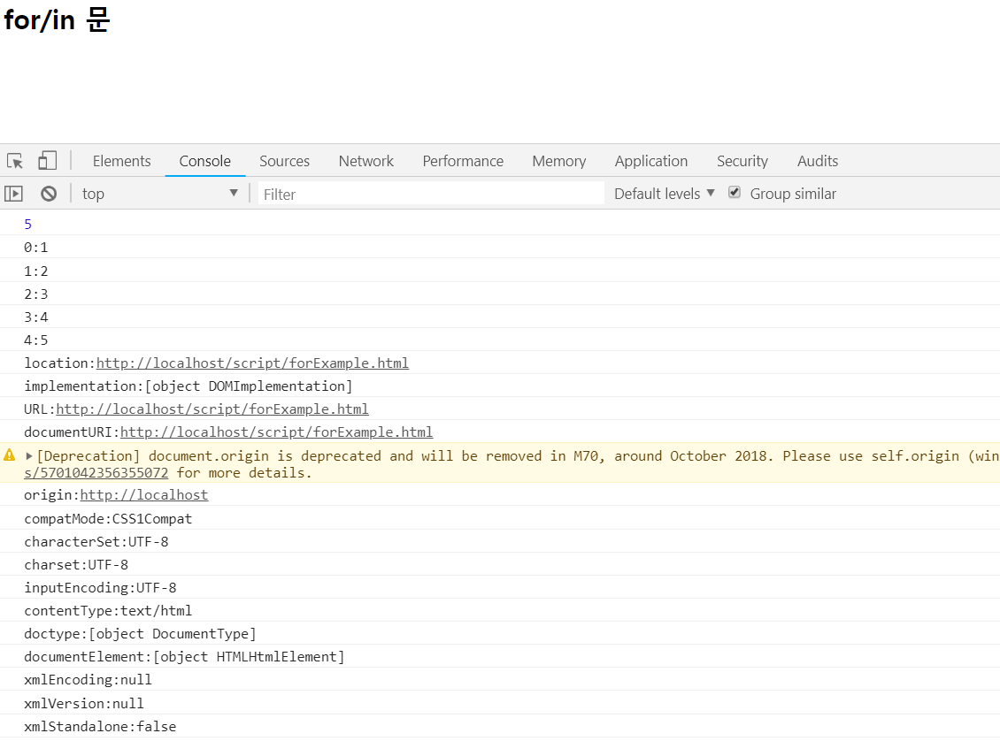

* 점프문 (이동문)
  * break 
  * continue
  * return

## hosting

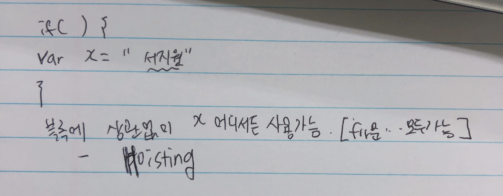

``` html
<script type="text/javascript">
			// 변수 hoisting
			for (var i = 0; i < 10; i++) {
				console.log(i);
			}

			console.log("for문 밖에서 : " + i);

			//전역변수 -- Map에 할당됨(Window객체의 key값[프로퍼티]으로 들어감) -- 동기화 될 가능성 농후
			var message = "변수 사용 범위";
			console.log(message);
			console.log(window.message); //결과값 같음
			function x() {
				//지역변수
				var message2 = "메시지";
				//message2 = "메시지"; // 전역변수
			}
			function y() {
				console.log(message);
				console.log(message2);
			}
			x();
			y();
		</script>
```

* 전역변수 vs 지역변수


# 자바 스크립트 함수

## 함수

* 재사용 가능한 자바스크립트 코드 블록

* 실행코드를 가지는 호출가능한 일급(first-class)객체

* 함수를 변수나 배열 등에 저장할 수 있고, 함수를 다른 함수에 인자로 전달하거나 반환 값으로 사용할 수 있다

* object 객체 / function 객체

* 다양한 함수 정의(생성)방법을 제공

  * 선언형 함수
  * 익명함수
  * function 생성자를 이용한 함수

  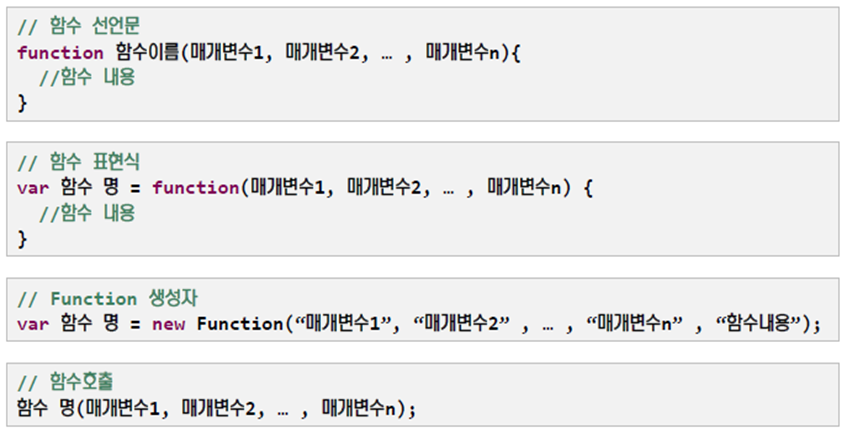

* 함수 매개변수
  * 매개변수 : 함수의 정의부분에 나열된 변수
  * 전달인자 : 함수를 호출할 때 전달되는 실제 값
  * JavaScript에서 함수 정의 시 매개변수에 대한 형식은 명시하지 않음
  * JavaScript의 배열 : collection이랑 똑같음 - 무조건 Array로 받음
  * 함수 호출 시, 정의된 매개변수와 전달인자의 개수가 일치하지 않더라도 호출 가능

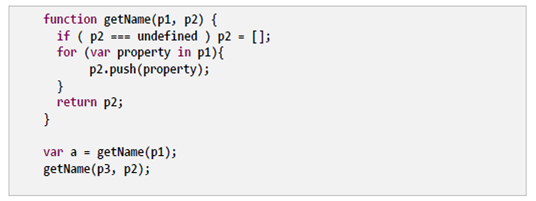

* 함수호출하기
  * +++call(), apply() 메서드를 통한 간접적 방식
* 함수 호출 순서
  * 각 전달인자 표현식(괄호 사이의 값들)이 평가
  * 평가 결과가 전달인자가 된다
  * 전달인자 값들은 함수정의에 지정한 매개변수와 대응됨
  * 함수 몸체에서 매개변수에 대한 참조는 해당 전달인자 값을 표현
* 반환값
  * return문의 값이 있으면 그 값을 반환 or undefined 반환

* 중첩 함수

  * 다른 함수와 중첩가능

  * 변수 범위규칙이 중첩된 함수는 해당 함수가 속한 함수의 매개변수와 변수에 접근가능

    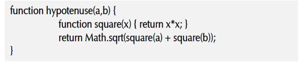

    * 굳이 이렇게 하는 이유는 ? 스코프 문제가 발생 - 자바의 private와 비슷

      ```html
      <head>
      <meta charset="utf-8">
      <title>자바스크립트 함수</title>
      <script type="text/javascript">
          sum(1,2,3); //호출하면 바로 됨 : 선언형 함수는 제일 먼저 함수가 먼저 만들어짐(hosting)
      	//show(); // 호출 불가
      	//#1. 선언형 함수 정의
      	function sum(x, y, z) {
      		return x + y + z;
      	} // 저장 - window
      	
      	//#2. 익명 함수 정의
      	var show = function(message){
      		document.write(message);
      	} 
      	function some(callback){
      		callback();
      	} // 이렇게 많이 씀
      	function some2(){
      		//----
      		return function(){
      			
      			document.write("리턴함수요..");
      		};
      	}
      	//#3. 중첩 함수
      	function hypotenus(a,b){
      		function square(x){
      			return x*x; // Math.pow(x,2)
      		}
      		return Math.sqrt(square(a)+square(b));
      	}
      </script>
      </head>
      <body>
        <script type="text/javascript">
      			//window객체에 등록된 sum 메소드 호출
      			var result = sum(10, 20, 30);
      			document.write("결과:"+ result);
      			
      			result=sum(10,20);
      			document.write("결과:"+ result); //결과 : NaN
      			
      			show("어렵지 않아요");
      			
      			some(function(){
      				document.write("익명함수 콜이요...")
      			});
      			some2()(); // 객체를 보내고 다시 받음(호출)
      			
      			alert(hypotenus(30,20));
      		</script>
      </body>
      ```

  Project 우클릭 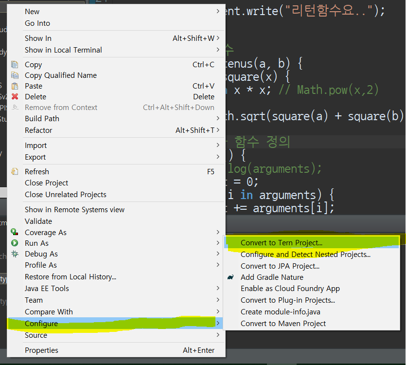

  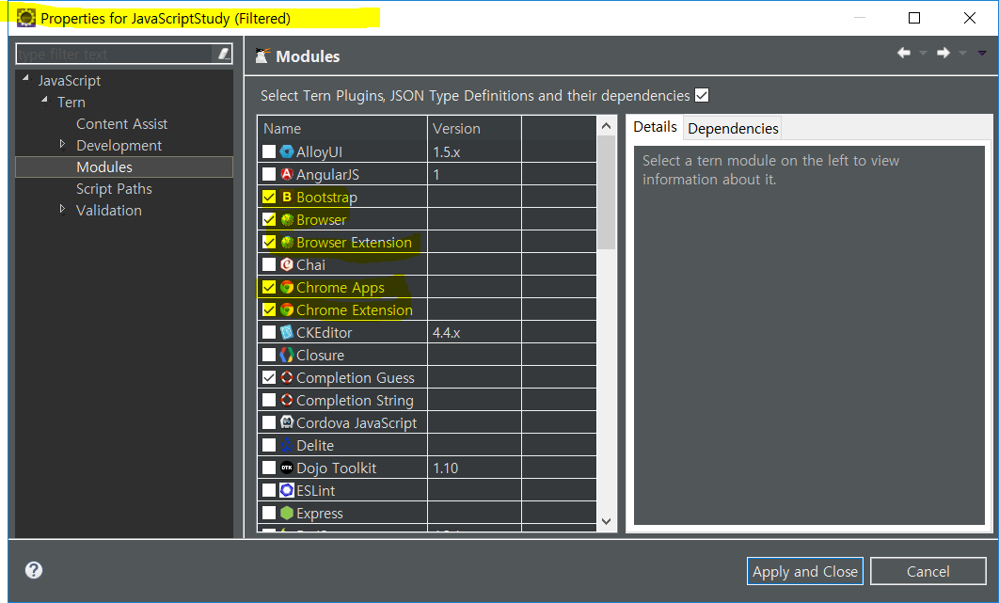

